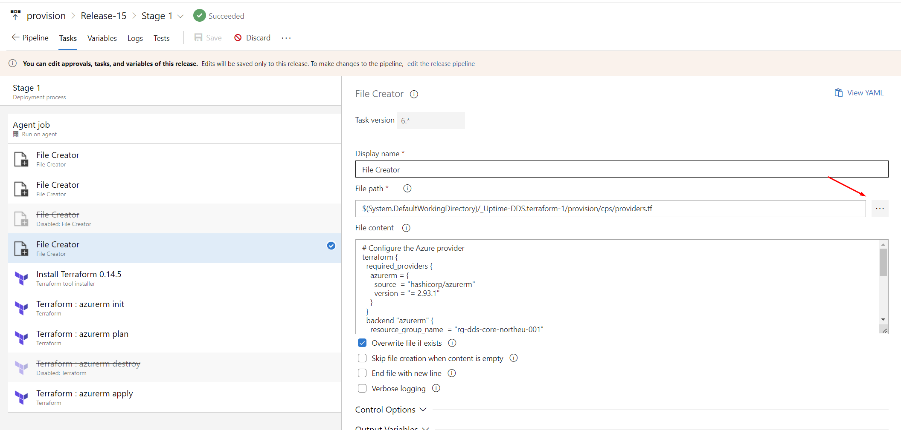
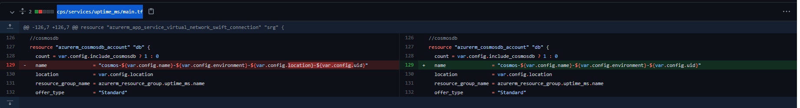

# Azure DevOps Release Pipeline

## Azure Prerequisites
- Azure DevOps organisation with a paid tier Microsoft-hosted agent as the initial terraform may exceed the free tier time limit
- Azure DevOps Terraform and File Creator Extensions
- Azure AD account with access rights to Azure DevOps and rights to configure a Service Principle with Contribute Permission on Subscription (Request for Service Principle) < get the Azure Owner to setup the Service Connection directly to the Subscription used for the Terraform depolyment >
- Infrastructure: https://github.dxc.com/Uptime/terraform/tree/master/cps 
- GitHub Enterprise to link on AzureDevOps (Terraform, Deployment pipelines)
- GitHub PAT (Personal Access Token) with rights to create a GitHub Enterprise Server service connection to https://github.dxc.com
- SonarQube installed in order to test code quality for backend APIs

# Deployment steps breakdown

## Setting up Terraform pipeline

- Importing/Forking project for repositories
  Github source code:
  
  > https://github.dxc.com/Uptime/terraform/tree/master/cps
  
- Creating a Pipeline / Connecting your Github to Azure DevOps 
> NOTE: If you don't have Github Organization yet, you can follow this guide [Deployment Best Practices](03%20Deployment%20Best%20Practices.md) 
  1. Go to Pipelines, and click New Pipeline  
     
  2. Click new connection
      
  3. Enter your PAT, and Enterprise URL (ex. https://github.dxc.com)
      
  4. Select All Repositories from the dropdown then select your Github Organization/repository
      
  5. Click "Starter Pipeline" then click Save and Run

  > If an error occurs about SonarQube, edit the YAML file and remove the SonarQube block if SonarQube is not present in current ADO instance. Select the version then click 'Run' button on the upper right of the page.

## Creating Release Pipeline
> For this steps, we will be importing a preset file that will add artifacts, and stages. For more information on creating from scratch, you can look up at: 'link here'

1. Go to Releases > click New > Import release pipeline
    
  
2. It will be looking for the Artifact that came from the template release pipeline we imported, in this case, we should remove the current artifact. Under Artifacts, click _Uptime.terraform, then click Delete.
    
  
3. Click '+ Add' beside Artifacts, and select your Source on the right sidebar that appears, then click Add. The remaining 2 options will be autofilled once Source is selected
    
  
4. Click on 'qa' from Stages, and rename it. You can now close the side window
  
5. Click on "1 job, 7 tasks" under Stages
  
6. You will be able to see 7 tasks, which are 3 File Creators, and Terraform tasks
  
7. An error will appear on some tasks, which could be under Agent Job, and File Creators. In this case, we will install extensions that would be used for these type of tasks. Link: https://dev.azure.com/WMShowCase/_redirect?target=https%3A%2F%2Fmarketplace.visualstudio.com%2Fitems%3FitemName%3Deliostruyf.build-task%26targetId%3Da58beef4-4e5e-488a-b5e2-3d2b9731a95e
    

8. Once done, replace the tasks' directory name using the build pipeline path, you can also view the folder by clicking the 3 dots beside the text-field (ex. $(System.DefaultWorkingDirectory)/_Uptime-DDS.terraform-1/provision/cps/locals.tf)

9. Terraform had a breaking change on the latest version, due to this, we must change the 3rd File Creator's contents by switching the version to "2.93.1"
  
10. Next, we will clear out 'Agent Job' error:
  
     10.1. Click 'Agent Job'
     
     10.2. On the right pane, select 'Agent pool' dropdown
     
     10.3. Select your Hosted, in our case 'Azure Pipelines'
     
     10.4. Select from the dropdown 'Agent Specification' > latest Ubuntu version
     
     10.5. Once done, rename your Pipeline, on the top portion beside 'All Pipelines > provision - Copy' by just hovering and clicking to rename
     
 11. Hit 'Save'

 ## IMPORTANT: Resetting the Subscription IDs from the imported pipeline template  
 1. For the 2 Terraform: azurerm tasks: azurerm plan, azurerm apply:
    - Go to Tasks
    - Select one of the Terraform tasks mentioned above
    - Under command, select init
    - AzureRM backend configuration section will appear
    - Fill out the remaining blank fields with the right values
    - Hit 'Save'
    - Repeat for the remaining Terraform azurerm task

## Declaring the variables for the pipeline
1. Go to Releases -> click Your Pipeline -> click Edit
    
    
2. You will be able to see your Artifacts, and Stages. Click Variables on the top selections

3. Setting up Variable groups:

     Setting up Variable groups for sensitive data, like secrets, passwords, etc.

     3.1. Click on 'Manage variable groups'

     3.2. Click on '+ Variable Group'

     3.3. Name your Variable Group

     3.4. Click '+Add' under Variable Group

     3.5. Add these 3:
     
    - az_tenant - ***[your service principle]*** - Found in Azure > Azure Active Directory
    - az_username - ***[your service principle]*** - If app has been registered, go to:
                Azure > Azure Active Directory > App registrations > All applications > Find app to use in the deployment - seen in column 'Application (client) ID'
    - az_password - ***[your service principle]*** - If app has been registered, go to:
                Azure > Azure Active Directory > App registrations > All applications > Select app > Certificates & Secrets > Secret ID
    
       
    
     3.6. Hit 'Save'
    
     3.7. Go back to Variables
    
     3.8. Select 'Variable Groups'
    
     3.9. Select your created/existing Variable Group created (Service Principles)

4. Setting up Pipeline Variables

     4.1. Change the az_subscription using your own azure subscription id

     4.2. Change the environment name, base on what environment this gets deployed

     4.3. Key would be the folder name in azure storage that we will use to store terraform.state, in this case you can rename it as:
     
    your-new-directory >/$(env)/terraform.tfstate 

     4.4. uid (unit_id) keep it empty to auto-generate unit_id, and should be populated if we are updating

       UID can only contain alphanumeric characters between 3-24 characters, you can use any input - or if needed, you can generate your UID randomly using this script, can be edited by going to:  
        1. Edit Release  
        2. Click 1 Job under Stages  
        3. Click 7 Tasks under provision  
        4. Click the 2nd File Creator and enter on the first line:  
        resource "random_id" "env_uid" {
        byte_length = 4
        }
        uid = lower(random_id.env_uid.hex)

     4.5. Tier = P1V2 default used for Staging, for more details about pricing and specification, you can view it here:
    
     Enter Excel File for the Pricing and Specifications here

     4.6. Hit 'Save'

5. Setting up Tasks, for Terraform - linking Service Principles in Azure subscription

     5.1. Go to Releases > Click your release pipeline > Click Edit

     5.2. Click Tasks

     5.3. On the 3 Terraforms job: azurerm init, azurerm plan, azurerm apply - change the Azure Subscription using your Service Connection

     5.4 Click on the 'Agent Job', and on the Agent Pool select your current Agent Pool to use in deploying

     5.5 On the 'Agent Specification', select latest ubuntu-latest version

     5.6 Click on the 2nd file creator, and under File Content - declare these in the locals block under the 'molecule_node':

     * redis_sku_name = "Premium"
     * redis_family = "P"  

     5.7 File Pathname should be the same with the deployed build pipeline path, the ellipsis on the left of the field value can be used and then point to the required location (path shown in image below):
     

     5.8 On the same file creator shown in the image on the previous step, change the version to "2.93.1", versions above has a breaking change that will cause issues running the release pipeline.  
    
     5.9 On the same File Creator, replace the resource group name, storage account name, and container name

6. Creating a new release  

    6.1. Go to 'Releases'

    6.2. Click 'Create Release' on the upper right portion of the screen

    6.3. Click 'Create'

## After deploying, an error will occur due to restriction on permissions. Redeploy using new Agent deployed on Uptime resource group's VM

- Details and instructions can be located at [here](../How%20to%20Set-up%20a%20Self%20host%20Agent%20on%20UPtime%20Resource%20Group.md)

## Notes:

apim.azurerm_api_management.srg could take 60-120 mins in creating so a paid agent pool might be required to increase timeout

CosmosDB only has a maximum of 44 characters, if issue is present:

> creating Database Account: (Name "cosmos-ms-uptime-base-api-sc2-eastus-c129bd42" / Resource Group "rg-func-ms-uptime-base-api-sc2-eastus-c129bd42"): creating/updating CosmosDB Account "cosmos-ms-uptime-base-api-sc2-eastus-c129bd42" (Resource Group "rg-func-ms-uptime-base-api-sc2-eastus-c129bd42"): documentdb.DatabaseAccountsClient#CreateOrUpdate: Failure sending request: StatusCode=400 -- Original Error: Code="BadRequest" Message="DatabaseAccount name 'cosmos-ms-uptime-base-api-sc2-eastus-c129bd42' is not valid since it is less than 3 characters or more than 44 characters long.\r\nActivityId: afcc278f-4e6a-4ca1-afd1-3116b6d09b21, Microsoft.Azure.Documents.Common/2.14.0
 change it in the Terraform repository:
cps/services/uptime_ms/main.tf

