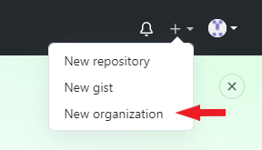
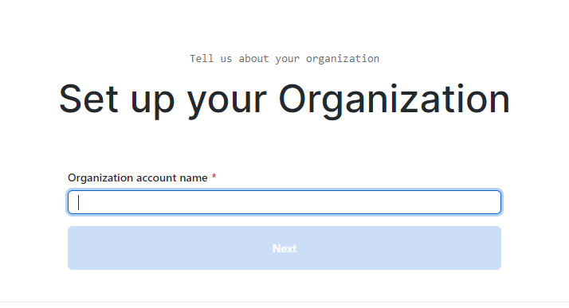
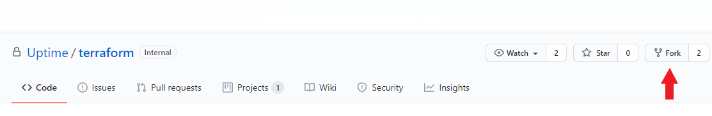
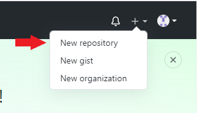
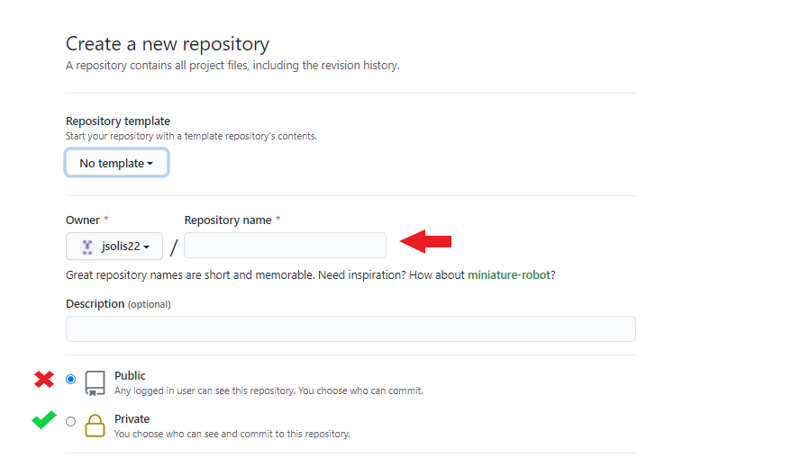

# Deployment Best Practices

This documentation covers the best practices in setting up your Azure for UpTime application requirements, and APIs. In this section, this will guide us in setting up:

1. Github Organization
2. Getting Terraform code from Uptime Terraform Github source

## Creating Github Organization

1. Login to your Github
2. Click the '+' icon on the upper right corner, beside your profile icon

   
   
3. Select 'New Organization'

   
   
4. Enter your Organization account name

> REMEMBER: Take note of your Organization Name since this will be used for the variables used in Azure DevOps, and Uptime code deployment

5. Add Organization members who will be working on deploying Azure

> NOTE: Creating/Forking repository will be under your Github Organization created recently

### **RECOMMENDED:** Forking repository

1. Go into https://github.dxc.com/Uptime/terraform/tree/master/cps 
2. On the upper right corner, click the button 'Fork'

   
   
3. Select your Organization created in this guide.

## Uploading the source code repository files into your Github Org 

1. Create your Github Repository

   
   
2. Add the 'Repository Name', and make sure that Public is not ticked for security purposes.
> OPTION: You can add a Readme.md for description or markdown files can also be created later.

3. Export then Import the Uptime's Terraform source code from the development team in your Terraform repository.

> https://github.dxc.com/Uptime/terraform/tree/master/cps

### Updating the fork from remote branch

1. Click 'Fetch Upstream', and click 'Fetch and Merge'. This only updates the current branch. You can also check the comparisons to check any changes made from the remote vs forked branch.

2. Once done, the build pipelines on DevOps will automatically update. You can check it on Azure DevOps as well, where the related repository is in the build pipeline.

3. If the build goes successful, go to Releases branch and Create a release, and select the version you want to deploy. The steps can be found at [Azure DevOps](Azure%20DevOps.md) at section Releases, #4.
