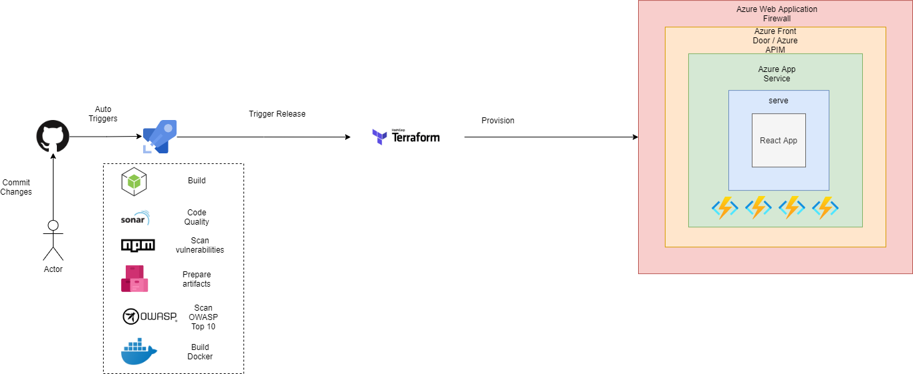
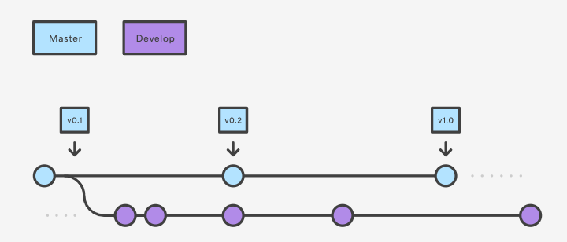
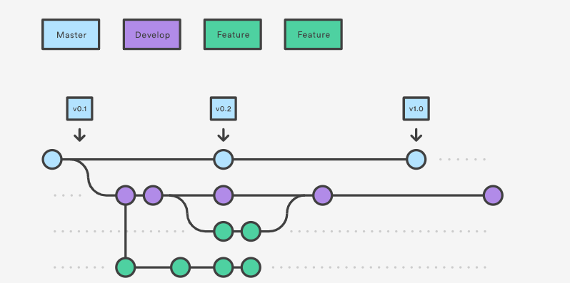
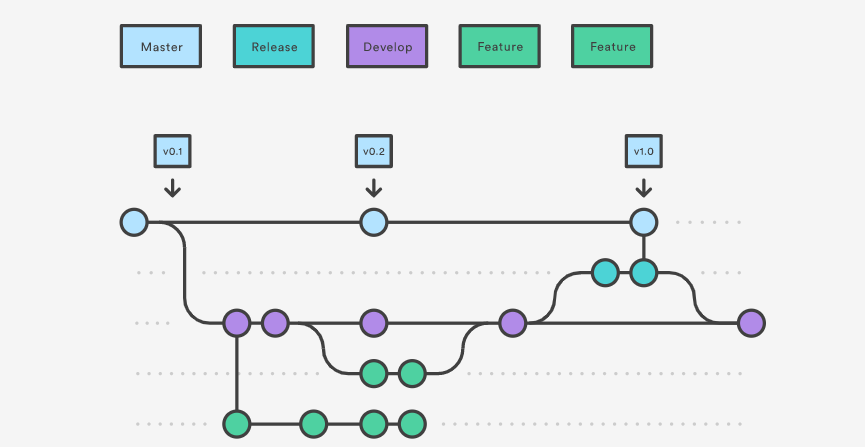
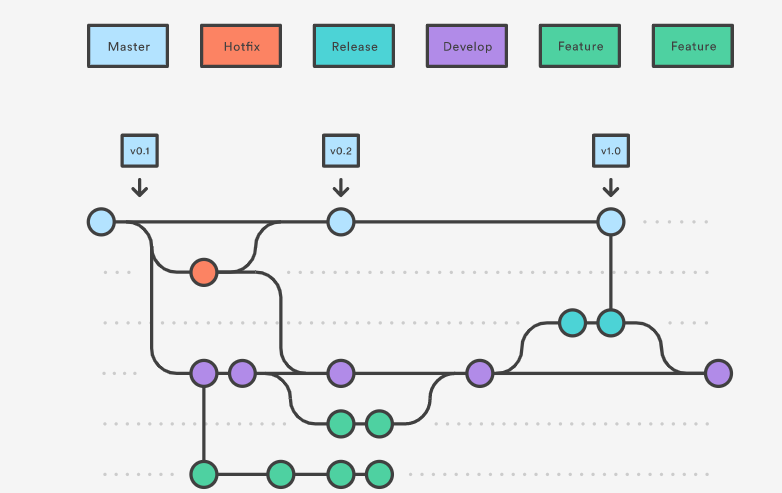

# General Application CI/CD Overview

**This document is being provided as a general reference and is not directly applicable to UPtime deployment and configuration procedures.**

.
# How we manage source code for release
## Github Work Flow
- https://www.atlassian.com/git/tutorials/comparing-workflows/gitflow-workflow
### Develop and Master Branches
- Instead of a single master branch, this workflow uses two branches to record the history of the project. The master branch stores the official release history, and the develop branch serves as an integration branch for features. It's also convenient to tag all commits in the master branch with a version number.



### Feature Branches
- Each new feature should reside in its own branch, which can be pushed to the central repository for backup/collaboration. But, instead of branching off of master, feature branches use develop as their parent branch. When a feature is complete, it gets merged back into develop. Features should never interact directly with master.

- We suggest we should give the feature branch as JIRA ticket number, it will help us to manage them in the future

- When you’re done with the development work on the feature, the next step is to merge the feature_branch into develop.



### Release Branches
- Once develop has acquired enough features for a release (or a predetermined release date is approaching), you fork a release branch off of develop. Creating this branch starts the next release cycle, so no new features can be added after this point—only bug fixes, documentation generation, and other release-oriented tasks should go in this branch. Once it's ready to ship, the release branch gets merged into master and tagged with a version number. In addition, it should be merged back into develop, which may have progressed since the release was initiated.

- Using a dedicated branch to prepare releases makes it possible for one team to polish the current release while another team continues working on features for the next release. It also creates well-defined phases of development (e.g., it's easy to say, “This week we're preparing for version 4.0,” and to actually see it in the structure of the repository).



### Hotfix Branches
- Maintenance or “hotfix” branches are used to quickly patch production releases. Hotfix branches are a lot like release branches and feature branches except they're based on master instead of develop. This is the only branch that should fork directly off of master. As soon as the fix is complete, it should be merged into both master and develop (or the current release branch), and master should be tagged with an updated version number.



# Azure DevOps Variables and Security
Variables give you a convenient way to get key bits of data into various parts of the pipeline. The most common use of variables is to define a value that you can then use in your pipeline. All variables are stored as strings and are mutable. The value of a variable can change from run to run or job to job of your pipeline.

When you define the same variable in multiple places with the same name, the most locally scoped variable wins. So, a variable defined at the job level can override a variable set at the stage level. A variable defined at the stage level will override a variable set at the pipeline root level. A variable set in the pipeline root level will override a variable set in the Pipeline settings UI.

Variables are different from runtime parameters, which are typed and available during template parsing.

Use a variable group to store values that you want to control and make available across multiple pipelines. You can also use variable groups to store secrets and other values that might need to be passed into a YAML pipeline. Variable groups are defined and managed in the Library page under Pipelines.

More information: https://docs.microsoft.com/en-us/azure/devops/pipelines/library/variable-groups?view=azure-devops&tabs=classic
## Variable scopes
In the YAML file, you can set a variable at various scopes:

- At the root level, to make it available to all jobs in the pipeline.
- At the stage level, to make it available only to a specific stage.
- At the job level, to make it available only to a specific job.
When a variable is defined at the top of a YAML, it will be available to all jobs and stages in the pipeline and is a global variable. Global variables defined in a YAML are not visible in the pipeline settings UI.

Variables at the job level override variables at the root and stage level. Variables at the stage level override variables at the root level.

## Access variables through the environment
Notice that variables are also made available to scripts through environment variables. The syntax for using these environment variables depends on the scripting language.

The name is upper-cased, and the . is replaced with the _. This is automatically inserted into the process environment. Here are some examples:

- Batch script: %VARIABLE_NAME%
- PowerShell script: $env:VARIABLE_NAME
- Bash script: $VARIABLE_NAME

## Set secret variables
To set secrets in the web interface, follow these steps:

- Go to the Pipelines page, select the appropriate pipeline, and then select Edit.
- Locate the Variables for this pipeline.
- Add or update the variable.
- Select the Secret lock icon to store the variable in an encrypted manner.
- Save the pipeline.
- Secret variables are encrypted at rest with a 2048-bit RSA key. Secrets are available on the agent for tasks and scripts to use. Be careful about who has access to alter your pipeline.

Unlike a normal variable, they are not automatically decrypted into environment variables for scripts. You need to explicitly map secret variables.

## Share variables across pipelines
To share variables across multiple pipelines in your project, use the web interface. Under Library, use variable groups.

More information: https://docs.microsoft.com/en-us/azure/devops/pipelines/process/variables?view=azure-devops&tabs=yaml%2Cbatch

# Terraform 
For the application we are using terraform to build and deploy the environments and components

Prerequisites
- Terraform CLI: https://www.terraform.io/downloads.html ( for development environment)
- Azure Service Principle Key has Owner Permission on Subscription
- Has Access Rights to access Azure DevOps
- https://dev.azure.com/mwa-microservices/Microservices%20Capabilities
Source Code and Build
- https://github.dxc.com/MWA/provision
- https://dev.azure.com/mwa-microservices/Microservices%20Capabilities/_release?_a=releases&view=mine&definitionId=1

```yaml
variable "customer_name" {
    default = "$(customer_name)"
}
variable "az_subscription" {
    default = "$(az_subscription)"
}
variable "az_username" {
    default = "$(az_username)"
}
variable "az_password" {
    default = "$(az_password)"
}
variable "az_tenant" {
    default = "$(az_tenant)"
}
variable "DOCKER_REGISTRY_SERVER_PASSWORD" {
    default = "$(DOCKER_REGISTRY_SERVER_PASSWORD)"
}
variable "DOCKER_REGISTRY_SERVER_URL" {
    default = "$(DOCKER_REGISTRY_SERVER_URL)"
}
variable "DOCKER_REGISTRY_SERVER_USERNAME" {
    default = "$(DOCKER_REGISTRY_SERVER_USERNAME)"
}
variable "frontend_image" {
    default = "$(frontend_image)"
}
variable "backend_image" {
    default = "$(backend_image)"
}
variable "itsm_image" {
    default = "$(itsm_image)"
}
variable "itsm_servicenow_image" {
    default = "$(itsm_servicenow_image)"
}
variable "app_database_image" {
    default = "$(app_database_image)"
}
variable "notification_image" {
    default = "$(notification_image)"
}
variable "apim_sku_name" {
    default = "$(apim_sku_name)"
}
variable "location" {
    default = "$(location)"
}
variable "PDXC_API" {
    default = "$(PDXC_API)"
}
variable "SNOW_PW" {
    default = "$(SNOW_PW)"
}
variable "SNOW_URL" {
    default = "$(SNOW_URL)"
}
variable "SNOW_USER" {
    default = "$(SNOW_USER)"
}
variable "keyvault_name" {
    default = "$(keyvaultName)"
}
variable "apim_name" {
    default = "$(apim_name)"
}
variable "cdn_name" {
    default = "$(cdn_name)"
}
variable "KB_ANNOUCEMENT_ENCODED_QUERY" {
    default = "$(KB_ANNOUCEMENT_ENCODED_QUERY)"
}
variable "KB_FEATURED_ENCODED_QUERY" {
    default = "$(KB_FEATURED_ENCODED_QUERY)"
}
variable "KB_TOP_ENCODED_QUERY" {
    default = "$(KB_TOP_ENCODED_QUERY)"
}
variable "KB_ANNOUCEMENT_CONDITION" {
    default = "$(KB_ANNOUCEMENT_CONDITION)"
}
variable "FIREBASE_ADMIN_AUTH" {
     default = "$(FIREBASE_ADMIN_AUTH)"
}
variable "FIREBASE_ADMIN_ENDPOINT" {
     default = "$(FIREBASE_ADMIN_ENDPOINT)"
}
variable "KB_BASE_IDS" {
    default = "$(KB_BASE_IDS)"
}

```
## Deployment Patterns:
- $(name)-shared-resource (resource group)
    - $(name)-appservice-linux (appservice - https://azure.microsoft.com/en-us/services/app-service/)
    - $(name)--application-insight ( application insight - https://docs.microsoft.com/en-us/azure/azure-monitor/app/app-insights-overview)
    - tfsta (storage account- https://azure.microsoft.com/en-us/pricing/details/storage/)
    - $(name)-apim $(name)-frontend (azure front door - https://azure.microsoft.com/en-us/services/frontdoor/)
    - $(name)wafpolicy (WAF policy - https://docs.microsoft.com/en-us/azure/web-application-firewall/ag/policy-overview)
    - $(name)-microservices-apim (api management - https://azure.microsoft.com/en-us/services/api-management/)
    - $(name)-cosmos-db (https://azure.microsoft.com/en-us/services/cosmos-db/)
    - $(name)-redis-cache (https://azure.microsoft.com/en-us/services/cache/)
    - $(name)-srg (https://docs.microsoft.com/en-us/azure/virtual-network/network-security-groups-overview)
    - $(name)-vnet (https://docs.microsoft.com/en-us/azure/virtual-network/virtual-networks-overview)
    - $(name)-keyvault (https://azure.microsoft.com/en-us/services/key-vault/)
- $(name)-frontend (resource group)
    - $(name)-frontend (webapp - https://azure.microsoft.com/en-us/services/app-service/web/)
- $(name)-backend (resource group)
    - itsm-microservice (function app - https://azure.microsoft.com/en-us/services/functions/)
    - itsm-servicenow-microservice (function app - https://azure.microsoft.com/en-us/services/functions/)
    - app-database-microservice (function app - https://azure.microsoft.com/en-us/services/functions/)

# Front End CI/CD
## Prerequisites 
- Azure Service Principle Key has Owner Permission on Subscription
- Has Access Rights to access Azure DevOps
- https://dev.azure.com/mwa-microservices/Microservices%20Capabilities

## Source Code and Build
- https://github.dxc.com/MWA/helix-frontend-webapp
- https://dev.azure.com/mwa-microservices/Microservices%20Capabilities/_build?definitionId=4


## Build Pipeline:
For the latest version you can find in here https://github.dxc.com/MWA/helix-frontend-webapp/blob/develop/azure-pipelines.yml
```yaml
- stage: Vulnerability
  displayName: Scan vulnerability application
  jobs:
  - job: Npm_Vulnerability
    displayName: Npm Vulnerability
    steps:
    - task: Npm@1
      displayName: npm install
      inputs:
        command: 'install'
        workingDir: 'azure/src'
    - task: CmdLine@2
      displayName: npm audit
      inputs:
        script: |
          sudo npm install -g retire --unsafe-perm=true --allow-root
          sudo npm install -g npm-audit-html --unsafe-perm=true --allow-root
          npm audit --json | npm-audit-html
          ls
        workingDirectory: 'azure/src'
    - task: CopyFiles@2
      displayName: 'Copy Files to: Copy Vulnerability Report'
      inputs:
        SourceFolder: './azure/src'
        Contents: |
          npm-audit.html
          !node_modules/**
        TargetFolder: '$(Build.ArtifactStagingDirectory)'
        OverWrite: true
    - task: PublishBuildArtifacts@1
      inputs:
        PathtoPublish: '$(Build.ArtifactStagingDirectory)'
        ArtifactName: 'vulnerability-report'
        publishLocation: 'Container'    
 
- stage: Publish
  displayName: Publish Artifacts
  jobs:
  - job: publish
    displayName: Publish
    steps:
    - task: Docker@2
      inputs:
        containerRegistry: 'mwamicroservicesdev'
        repository: 'mwa-microservice/build/helix/helix-frontend'
        command: 'buildAndPush'
        Dockerfile: 'azure/src/Dockerfile'
        tags: '$(Build.SourceBranchName).$(Build.BuildId)'
    - task: CopyFiles@2
      displayName: 'Copy Files to: Staging Artifact'
      inputs:
        SourceFolder: ./azure
        TargetFolder: '$(Build.ArtifactStagingDirectory)'
        OverWrite: true
    - task: PublishBuildArtifacts@1
      inputs:
        PathtoPublish: '$(Build.ArtifactStagingDirectory)'
        ArtifactName: 'uptime-frontend'
        publishLocation: 'Container'
```
## Configuration file
For some limitation in React we can't set variables environment in azure webapp settings. We need to modify it before docker build step
- https://dev.azure.com/mwa-microservices/Microservices%20Capabilities/_release?_a=releases&view=mine&definitionId=8
```txt
REACT_APP_AZURE_REG=$(REACT_APP_AZURE_REG)
REACT_APP_WEBSITE_NAME=$(REACT_APP_WEBSITE_NAME)
REACT_APP_OCP_APIM_URL=$(REACT_APP_OCP_APIM_URL)
REACT_APP_OCP_APIM_SUBSCRIPTION_KEY=$(REACT_APP_OCP_APIM_SUBSCRIPTION_KEY)
REACT_APP_APPINSIGHTS_INSTRUMENTATIONKEY=$(APPINSIGHTS_INSTRUMENTATIONKEY)
REACT_APP_OKTA_BASE_URL=$(REACT_APP_OKTA_BASE_URL)
REACT_APP_OKTA_CLIENTID=$(REACT_APP_OKTA_CLIENTID)
REACT_APP_OKTA_LOGO=$(REACT_APP_OKTA_LOGO)
REACT_APP_FIREBASE_APIKEY=$(REACT_APP_FIREBASE_APIKEY)
REACT_APP_FIREBASE_AUTHDOMAIN=$(REACT_APP_FIREBASE_AUTHDOMAIN)
REACT_APP_FIREBASE_PROJECTID=$(REACT_APP_FIREBASE_PROJECTID)
REACT_APP_FIREBASE_STORAGEBUCKET=$(REACT_APP_FIREBASE_STORAGEBUCKET)
REACT_APP_FIREBASE_MESSAGINGSENDERID=$(REACT_APP_FIREBASE_MESSAGINGSENDERID)
REACT_APP_FIREBASE_APPID=$(REACT_APP_FIREBASE_APPID)
REACT_APP_NOTIFICATION_OCP_APIM_URL=$(REACT_APP_NOTIFICATION_OCP_APIM_URL)
REACT_APP_NOTIFICATION_OCP_APIM_SUBSCRIPTION_KEY=$(REACT_APP_NOTIFICATION_OCP_APIM_SUBSCRIPTION_KEY)
```
# Backend CI/CD
## ITSM CI/CD
### Prerequisites 
- Azure Service Principle Key has Owner Permission on Subscription
- Has Access Rights to access Azure DevOps
- https://dev.azure.com/mwa-microservices/Microservices%20Capabilities
### Source Code and Build
- https://github.dxc.com/MWA/ms-itsm
- https://dev.azure.com/mwa-microservices/Microservices%20Capabilities/_build?definitionId=8
- http://mwasonarqube.eastus2.cloudapp.azure.com/dashboard?id=build%3Ahelix-itsm-microservice

## Build Pipeline:
For the latest version you can find in here https://github.dxc.com/MWA/ms-itsm/blob/develop/azure-pipelines.yml
```yaml
# Starter pipeline
# Start with a minimal pipeline that you can customize to build and deploy your code.
# Add steps that build, run tests, deploy, and more:
# https://aka.ms/yaml
 
trigger:
- master
- develop
- release/*
 
pool:
  vmImage: 'ubuntu-20.04'
 
stages:
- stage: Build
  displayName: Build application
  jobs:
  - job: Build
    displayName: Nodejs Build
    steps:
    - task: Npm@1
      displayName: npm install
      inputs:
        command: 'install'
        workingDir: 'azure/function'
- stage: Code_Quality
  displayName: Scan Code Quality
  condition: and(succeeded(), ne(variables['Build.Reason'], 'PullRequest'))
  jobs:
  - job: Sonar
    displayName: Sonar
    steps:
    - task: SonarQubePrepare@4
      inputs:
        SonarQube: 'mwasonarqube'
        scannerMode: 'CLI'
        configMode: 'manual'
        cliProjectKey: 'build:helix-itsm-microservice'
        cliProjectName: 'build:helix-itsm-microservice'
        cliProjectVersion: '$(Build.SourceBranchName)'
        cliSources: '.'
        extraProperties: |
          # Additional properties that will be passed to the scanner,
          # Put one key=value per line, example:
          # sonar.exclusions=**/*.bin
          sonar.coverage.exclusions = "**/server.js"
 
    - task: SonarQubeAnalyze@4
    - task: SonarQubePublish@4
      inputs:
        pollingTimeoutSec: '300'
- stage: Vulnerability
  displayName: Scan vulnerability application
  jobs:
  - job: Npm_Vulnerability
    displayName: Npm Vulnerability
    steps:
    - task: Npm@1
      displayName: npm install
      inputs:
        command: 'install'
        workingDir: 'azure/function'
    - task: CmdLine@2
      displayName: npm audit
      inputs:
        script: |
          sudo npm install -g retire --unsafe-perm=true --allow-root
          sudo npm install -g npm-audit-html --unsafe-perm=true --allow-root
          npm audit --json | npm-audit-html
          ls
        workingDirectory: 'azure/function'
    - task: CopyFiles@2
      displayName: 'Copy Files to: Copy Vulnerability Report'
      inputs:
        SourceFolder: './azure/function'
        Contents: |
          npm-audit.html
          !node_modules/**
        TargetFolder: '$(Build.ArtifactStagingDirectory)'
        OverWrite: true
    - task: PublishBuildArtifacts@1
      inputs:
        PathtoPublish: '$(Build.ArtifactStagingDirectory)'
        ArtifactName: 'vulnerability-report'
        publishLocation: 'Container'    
 
- stage: Publish
  displayName: Publish Artifacts
  jobs:
  - job: publish
    displayName: Publish
    steps:
    - task: CopyFiles@2
      displayName: 'Copy Files to: Staging Artifact'
      inputs:
        SourceFolder: ./azure
        TargetFolder: '$(Build.ArtifactStagingDirectory)'
        OverWrite: true
    - task: PublishBuildArtifacts@1
      inputs:
        PathtoPublish: '$(Build.ArtifactStagingDirectory)'
        ArtifactName: 'helix-itsm-microservice'
        publishLocation: 'Container'
```
### Terraform Template
The latest version you can find in here https://github.dxc.com/MWA/provision/blob/master/usecase/helix/main.tf
```txt
resource "azurerm_resource_group" "itsm_beg" {
  name     = "${var.customer_name}-backend"
  location = "${var.location }"
}

resource "azurerm_function_app" "itsm_beg" {
  name                      = "${var.customer_name}-itsm-microservice"
  location                  = azurerm_resource_group.itsm_beg.location
  resource_group_name       = azurerm_resource_group.itsm_beg.name
  app_service_plan_id       = azurerm_app_service_plan.srg.id
  storage_account_name      = azurerm_storage_account.srg.name
  storage_account_access_key = azurerm_storage_account.srg.primary_access_key
  os_type                    = "linux"
  https_only = true
  site_config {
    always_on        = true
    linux_fx_version   = "DOCKER|${var.itsm_image}"
  }
  app_settings = {
    DOCKER_REGISTRY_SERVER_PASSWORD = "@Microsoft.KeyVault(SecretUri=${azurerm_key_vault_secret.DOCKER_REGISTRY_SERVER_PASSWORD.versionless_id}/${azurerm_key_vault_secret.DOCKER_REGISTRY_SERVER_PASSWORD.version})"
    DOCKER_REGISTRY_SERVER_URL      = "@Microsoft.KeyVault(SecretUri=${azurerm_key_vault_secret.DOCKER_REGISTRY_SERVER_URL.versionless_id}/${azurerm_key_vault_secret.DOCKER_REGISTRY_SERVER_URL.version})"
    DOCKER_REGISTRY_SERVER_USERNAME = "@Microsoft.KeyVault(SecretUri=${azurerm_key_vault_secret.DOCKER_REGISTRY_SERVER_USERNAME.versionless_id}/${azurerm_key_vault_secret.DOCKER_REGISTRY_SERVER_USERNAME.version})"
    APPINSIGHTS_INSTRUMENTATIONKEY = "@Microsoft.KeyVault(SecretUri=${azurerm_key_vault_secret.APPINSIGHTS_INSTRUMENTATIONKEY.versionless_id}/${azurerm_key_vault_secret.APPINSIGHTS_INSTRUMENTATIONKEY.version})"
    APPLICATIONINSIGHTS_CONNECTION_STRING =  "@Microsoft.KeyVault(SecretUri=${azurerm_key_vault_secret.APPLICATIONINSIGHTS_CONNECTION_STRING.versionless_id}/${azurerm_key_vault_secret.APPLICATIONINSIGHTS_CONNECTION_STRING.version})"
    ITSM_SERVICENOW                 = "@Microsoft.KeyVault(SecretUri=${azurerm_key_vault_secret.ITSM_SERVICENOW.versionless_id}/${azurerm_key_vault_secret.ITSM_SERVICENOW.version})"
    DB_API                          = "@Microsoft.KeyVault(SecretUri=${azurerm_key_vault_secret.DB_API.versionless_id}/${azurerm_key_vault_secret.DB_API.version})"
    REDISCACHEHOSTNAME = "@Microsoft.KeyVault(SecretUri=${azurerm_key_vault_secret.REDISCACHEHOSTNAME.versionless_id}/${azurerm_key_vault_secret.REDISCACHEHOSTNAME.version})"
    REDISCACHEKEY = "@Microsoft.KeyVault(SecretUri=${azurerm_key_vault_secret.REDISCACHEKEY.versionless_id}/${azurerm_key_vault_secret.REDISCACHEKEY.version})"
    AZURE_STORAGE = "@Microsoft.KeyVault(SecretUri=${azurerm_key_vault_secret.AZURE_STORAGE.versionless_id}/${azurerm_key_vault_secret.AZURE_STORAGE.version})"
    WEBSITE_ENABLE_SYNC_UPDATE_SITE = true
    WEBSITES_ENABLE_APP_SERVICE_STORAGE  = false
  }
}
```

## ITSM-Servicenow CI/CD
### Prerequisites 
- Azure Service Principle Key has Owner Permission on Subscription
- Has Access Rights to access Azure DevOps
- https://dev.azure.com/mwa-microservices/Microservices%20Capabilities
### Source Code and Build
- https://github.dxc.com/MWA/ms-itsm-servicenow
- https://dev.azure.com/mwa-microservices/Microservices%20Capabilities/_build?definitionId=9
- http://mwasonarqube.eastus2.cloudapp.azure.com/dashboard?id=build%3Ahelix-itsm-servicenow-microservice

## Build Pipeline:
For the latest version you can find in here https://github.dxc.com/MWA/ms-itsm-servicenow/blob/develop/azure-pipelines.yml
```yaml
# Starter pipeline
# Start with a minimal pipeline that you can customize to build and deploy your code.
# Add steps that build, run tests, deploy, and more:
# https://aka.ms/yaml
 
trigger:
- master
- develop
- feature/*
- release/*
 
pool:
  vmImage: 'ubuntu-20.04'
 
stages:
- stage: Build
  displayName: Build application
  jobs:
  - job: Build
    displayName: Nodejs Build
    steps:
    - task: Npm@1
      displayName: npm install
      inputs:
        command: 'install'
        workingDir: 'azure/function'
- stage: Code_Quality
  displayName: Scan Code Quality
  condition: and(succeeded(), ne(variables['Build.Reason'], 'PullRequest'))
  jobs:
  - job: Sonar
    displayName: Sonar
    steps:
    - task: SonarQubePrepare@4
      inputs:
        SonarQube: 'mwasonarqube'
        scannerMode: 'CLI'
        configMode: 'manual'
        cliProjectKey: 'build:helix-itsm-servicenow-microservice'
        cliProjectName: 'build:helix-itsm-servicenow-microservice'
        cliProjectVersion: '$(Build.SourceBranchName)'
        cliSources: '.'
        extraProperties: |
          # Additional properties that will be passed to the scanner,
          # Put one key=value per line, example:
          # sonar.exclusions=**/*.bin
          sonar.coverage.exclusions = "**/server.js"
 
    - task: SonarQubeAnalyze@4
    - task: SonarQubePublish@4
      inputs:
        pollingTimeoutSec: '300'
- stage: Vulnerability
  displayName: Scan vulnerability application
  jobs:
  - job: Npm_Vulnerability
    displayName: Npm Vulnerability
    steps:
    - task: Npm@1
      displayName: npm install
      inputs:
        command: 'install'
        workingDir: 'azure/function'
    - task: CmdLine@2
      displayName: npm audit
      inputs:
        script: |
          sudo npm install -g retire --unsafe-perm=true --allow-root
          sudo npm install -g npm-audit-html --unsafe-perm=true --allow-root
          npm audit --json | npm-audit-html
          ls
        workingDirectory: 'azure/function'
    - task: CopyFiles@2
      displayName: 'Copy Files to: Copy Vulnerability Report'
      inputs:
        SourceFolder: './azure/function'
        Contents: |
          npm-audit.html
          !node_modules/**
        TargetFolder: '$(Build.ArtifactStagingDirectory)'
        OverWrite: true
    - task: PublishBuildArtifacts@1
      inputs:
        PathtoPublish: '$(Build.ArtifactStagingDirectory)'
        ArtifactName: 'vulnerability-report'
        publishLocation: 'Container'    
 
- stage: Publish
  displayName: Publish Artifacts
  jobs:
  - job: publish
    displayName: Publish
    steps:
    - task: CopyFiles@2
      displayName: 'Copy Files to: Staging Artifact'
      inputs:
        SourceFolder: ./azure
        TargetFolder: '$(Build.ArtifactStagingDirectory)'
        OverWrite: true
    - task: PublishBuildArtifacts@1
      inputs:
        PathtoPublish: '$(Build.ArtifactStagingDirectory)'
        ArtifactName: 'helix-itsm-servicenow-microservice'
        publishLocation: 'Container'
```
### Terraform Template
The latest version you can find in here https://github.dxc.com/MWA/provision/blob/master/usecase/helix/main.tf
```txt
resource "azurerm_resource_group" "itsm_servicenow_beg" {
  name     = "${var.customer_name}-backend"
  location = "${var.location }"
}

resource "azurerm_function_app" "itsm_servicenow_beg" {
  name                      = "${var.customer_name}-itsm-servicenow-microservice"
  location                  = azurerm_resource_group.itsm_servicenow_beg.location
  resource_group_name       = azurerm_resource_group.itsm_servicenow_beg.name
  app_service_plan_id       = azurerm_app_service_plan.srg.id
  storage_account_name      = azurerm_storage_account.srg.name
  storage_account_access_key = azurerm_storage_account.srg.primary_access_key
  os_type                    = "linux"
  https_only = true
  version                    = "~3"
  identity {
    type = "SystemAssigned"
  }
  site_config {
    always_on        = true
    linux_fx_version   = "DOCKER|${var.itsm_servicenow_image}"
  }
  app_settings = {
    DOCKER_REGISTRY_SERVER_PASSWORD = "${var.DOCKER_REGISTRY_SERVER_PASSWORD}"
    DOCKER_REGISTRY_SERVER_URL      = "${var.DOCKER_REGISTRY_SERVER_URL}"
    DOCKER_REGISTRY_SERVER_USERNAME = "${var.DOCKER_REGISTRY_SERVER_USERNAME}"
    APPINSIGHTS_INSTRUMENTATIONKEY = azurerm_application_insights.srg.instrumentation_key
    APPLICATIONINSIGHTS_CONNECTION_STRING =  azurerm_application_insights.srg.connection_string
    SNOW_URL  = "@Microsoft.KeyVault(SecretUri=${azurerm_key_vault_secret.SNOW_URL.versionless_id}/${azurerm_key_vault_secret.SNOW_URL.version})"
    SNOW_USER = "@Microsoft.KeyVault(SecretUri=${azurerm_key_vault_secret.SNOW_USER.versionless_id}/${azurerm_key_vault_secret.SNOW_USER.version})"
    SNOW_PW = "@Microsoft.KeyVault(SecretUri=${azurerm_key_vault_secret.SNOW_PW.versionless_id}/${azurerm_key_vault_secret.SNOW_PW.version})"
    CONNECTNOW_INBOUND  = "api/mpsc/connectnow/inbound"
    PDXC_INTEGRATION  = true
    KB_BASE_IDS = "${var.KB_BASE_IDS}"
    FE_KB_URL_TEMPLATE = "https://${var.customer_name}-frontend.azurefd.net/knowledges/detail/{KB_NUMBER}"
    PDXC_API = "${var.PDXC_API}"
    KB_CONTENT_TEXT_LIMIT = "200"
    PDXC_API_TABLE_URL = "{\"INCIDENT\":\"inc1-dev\",\"REQUEST\":\"req1-dev\"}"
    KB_ANNOUCEMENT_ENCODED_QUERY = "${var.KB_ANNOUCEMENT_ENCODED_QUERY}"
    KB_TOP_ENCODED_QUERY = "${var.KB_TOP_ENCODED_QUERY}"
    KB_FEATURED_ENCODED_QUERY = "${var.KB_FEATURED_ENCODED_QUERY}"
    KB_ANNOUCEMENT_CONDITION = "${var.KB_ANNOUCEMENT_CONDITION}"
    WEBSITE_ENABLE_SYNC_UPDATE_SITE = true
    WEBSITES_ENABLE_APP_SERVICE_STORAGE  = false
  }
}
```

## App-database CI/CD
### Prerequisites 
- Azure Service Principle Key has Owner Permission on Subscription
- Has Access Rights to access Azure DevOps
- https://dev.azure.com/mwa-microservices/Microservices%20Capabilities
### Source Code and Build
- https://github.dxc.com/MWA/ms-app-database
- https://dev.azure.com/mwa-microservices/Microservices%20Capabilities/_build?definitionId=10
## Build Pipeline:
For the latest version you can find in here https://github.dxc.com/MWA/ms-app-database/blob/develop/azure-pipelines.yml
```yaml
resource "azurerm_resource_group" "cosmos_app_database_beg" {
  name     = "${var.customer_name}-backend"
  location = "${var.location }"
}

resource "azurerm_function_app" "cosmos_app_database_beg" {
  name                      = "${var.customer_name}-app-database-microservice"
  location                  = azurerm_resource_group.cosmos_app_database_beg.location
  resource_group_name       = azurerm_resource_group.cosmos_app_database_beg.name
  app_service_plan_id       = azurerm_app_service_plan.srg.id
  storage_account_name      = azurerm_storage_account.srg.name
  storage_account_access_key = azurerm_storage_account.srg.primary_access_key
  os_type                    = "linux"
  https_only = true
  version                    = "~3"
  identity {
    type = "SystemAssigned"
  }
  site_config {
    always_on        = true
    linux_fx_version   = "DOCKER|${var.app_database_image}"
  }
  app_settings = {
    DOCKER_REGISTRY_SERVER_PASSWORD = "${var.DOCKER_REGISTRY_SERVER_PASSWORD}"
    DOCKER_REGISTRY_SERVER_URL      = "${var.DOCKER_REGISTRY_SERVER_URL}"
    DOCKER_REGISTRY_SERVER_USERNAME = "${var.DOCKER_REGISTRY_SERVER_USERNAME}"
    APPINSIGHTS_INSTRUMENTATIONKEY = azurerm_application_insights.srg.instrumentation_key
    APPLICATIONINSIGHTS_CONNECTION_STRING =  azurerm_application_insights.srg.connection_string
    HOST = "@Microsoft.KeyVault(SecretUri=${azurerm_key_vault_secret.HOST.versionless_id}/${azurerm_key_vault_secret.HOST.version})"
    AUTH_KEY = "@Microsoft.KeyVault(SecretUri=${azurerm_key_vault_secret.AUTH_KEY.versionless_id}/${azurerm_key_vault_secret.AUTH_KEY.version})"
    DATABASE_ID = "@Microsoft.KeyVault(SecretUri=${azurerm_key_vault_secret.DATABASE_ID.versionless_id}/${azurerm_key_vault_secret.DATABASE_ID.version})"
    DATABASE_CONNECTION = "@Microsoft.KeyVault(SecretUri=${azurerm_key_vault_secret.DATABASE_CONNECTION.versionless_id}/${azurerm_key_vault_secret.DATABASE_CONNECTION.version})"
    ITSM_SERVICES_API = "@Microsoft.KeyVault(SecretUri=${azurerm_key_vault_secret.ITSM_SERVICES_API.versionless_id}/${azurerm_key_vault_secret.ITSM_SERVICES_API.version})"
    WEBSITE_ENABLE_SYNC_UPDATE_SITE = true
    WEBSITES_ENABLE_APP_SERVICE_STORAGE  = false
  }
}
```
## Notification CI/CD
### Prerequisites 
- Azure Service Principle Key has Owner Permission on Subscription
- Has Access Rights to access Azure DevOps
- https://dev.azure.com/mwa-microservices/Microservices%20Capabilities
### Source Code and Build
- https://github.dxc.com/MWA/ms-notification
- https://dev.azure.com/mwa-microservices/Microservices%20Capabilities/_build?definitionId=12
## Build Pipeline:
For the latest version you can find in here https://github.dxc.com/MWA/ms-notification/blob/develop/azure-pipelines.yml
```yaml
resource "azurerm_resource_group" "notification_beg" {
  name     = "${var.customer_name}-backend"
  location = "${var.location }"
}

resource "azurerm_function_app" "notification_beg" {
  name                      = "${var.customer_name}-notification-microservice"
  location                  = azurerm_resource_group.notification_beg.location
  resource_group_name       = azurerm_resource_group.notification_beg.name
  app_service_plan_id       = azurerm_app_service_plan.srg.id
  storage_account_name      = azurerm_storage_account.srg.name
  storage_account_access_key = azurerm_storage_account.srg.primary_access_key
  os_type                    = "linux"
  https_only = true
  version                    = "~3"
  identity {
    type = "SystemAssigned"
  }
  site_config {
    always_on        = true
    linux_fx_version   = "DOCKER|${var.notification_image}"
  }
  app_settings = {
    DOCKER_REGISTRY_SERVER_PASSWORD = "${var.DOCKER_REGISTRY_SERVER_PASSWORD}"
    DOCKER_REGISTRY_SERVER_URL      = "${var.DOCKER_REGISTRY_SERVER_URL}"
    DOCKER_REGISTRY_SERVER_USERNAME = "${var.DOCKER_REGISTRY_SERVER_USERNAME}"
    APPINSIGHTS_INSTRUMENTATIONKEY = azurerm_application_insights.srg.instrumentation_key
    APPLICATIONINSIGHTS_CONNECTION_STRING =  azurerm_application_insights.srg.connection_string
    DB_API                          = "@Microsoft.KeyVault(SecretUri=${azurerm_key_vault_secret.DB_API.versionless_id}/${azurerm_key_vault_secret.DB_API.version})"
    FIREBASE_ADMIN_AUTH = "@Microsoft.KeyVault(SecretUri=${azurerm_key_vault_secret.FIREBASE_ADMIN_AUTH.versionless_id}/${azurerm_key_vault_secret.FIREBASE_ADMIN_AUTH.version})"
    FIREBASE_ADMIN_ENDPOINT = "@Microsoft.KeyVault(SecretUri=${azurerm_key_vault_secret.FIREBASE_ADMIN_ENDPOINT.versionless_id}/${azurerm_key_vault_secret.FIREBASE_ADMIN_ENDPOINT.version})"
    AZURE_SERVICEBUS_CONNECTIONSTRING ="@Microsoft.KeyVault(SecretUri=${azurerm_key_vault_secret.AZURE_SERVICEBUS_CONNECTIONSTRING.versionless_id}/${azurerm_key_vault_secret.AZURE_SERVICEBUS_CONNECTIONSTRING.version})"
    WEBPUSH_TOPIC = "${var.customer_name}-topic"
    WEBPUSH_SUBSCRIPTION = "notification"
    WEBSITE_ENABLE_SYNC_UPDATE_SITE = true
    WEBSITES_ENABLE_APP_SERVICE_STORAGE  = false
  }
}
```
# Azure API Magement
For each of microservices we will publish api to API management by using the swagger
- https://github.dxc.com/MWA/ms-app-database/blob/develop/azure/apim/swagger.json
- https://github.dxc.com/MWA/ms-itsm/blob/develop/azure/apim/swagger.json
- https://github.dxc.com/MWA/ms-itsm-servicenow/blob/develop/azure/apim/swagger.json

# Azure KeyVault
Azure Key Vault is a cloud service for securely storing and accessing secrets. A secret is anything that you want to tightly control access to, such as API keys, passwords, certificates, or cryptographic keys. Key Vault service supports two types of containers: vaults and managed hardware security module(HSM) pools. Vaults support storing software and HSM-backed keys, secrets, and certificates. Managed HSM pools only support HSM-backed keys.

To do any operations with Key Vault, you first need to authenticate to it. There are three ways to authenticate to Key Vault:
- Managed identities for Azure resources: When you deploy an app on a virtual machine in Azure, you can assign an identity to your virtual machine that has access to Key Vault. You can also assign identities to other Azure resources. The benefit of this approach is that the app or service isn't managing the rotation of the first secret. Azure automatically rotates the identity. We recommend this approach as a best practice.

- Service principal and certificate: You can use a service principal and an associated certificate that has access to Key Vault. We don't recommend this approach because the application owner or developer must rotate the certificate.

- Service principal and secret: Although you can use a service principal and a secret to authenticate to Key Vault, we don't recommend it. It's hard to automatically rotate the bootstrap secret that's used to authenticate to Key Vault.

## Azure security baseline for Key Vault
https://docs.microsoft.com/en-us/security/benchmark/azure/baselines/key-vault-security-baseline

## Add new key vault secret using Terraform 

```yaml
resource "azurerm_key_vault_secret" "example" {
  name         = "secret-sauce"
  value        = "szechuan"
  key_vault_id = azurerm_key_vault.example.id
}
```
https://registry.terraform.io/providers/hashicorp/azurerm/latest/docs/resources/key_vault_secret

## Custom Configuration For KeyVault
https://registry.terraform.io/providers/hashicorp/azurerm/latest/docs/resources/key_vault

## Current Keyvault
```yaml
resource "azurerm_redis_cache" "redis" {
  name                = "${var.customer_name}-redis-cache"
  location            = azurerm_resource_group.srg.location
  resource_group_name = azurerm_resource_group.srg.name
  capacity            = 0
  family              = "C"
  sku_name            = "Basic"
  enable_non_ssl_port = false
  minimum_tls_version = "1.2"

  redis_configuration {
  }
}
resource "azurerm_cdn_profile" "cdn" {
  name                = "${var.cdn_name}"
  location            = azurerm_resource_group.srg.location
  resource_group_name = azurerm_resource_group.srg.name
  sku                 = "Standard_Akamai"
}

resource "azurerm_cdn_endpoint" "cdn" {
  name                = "${var.cdn_name}"
  profile_name        = azurerm_cdn_profile.cdn.name
  location            = azurerm_resource_group.srg.location
  resource_group_name = azurerm_resource_group.srg.name

  origin {
    name      = "${var.cdn_name}"
    host_name = "${azurerm_storage_account.srg.name}.blob.core.windows.net"
  }
  origin_host_header = "${azurerm_storage_account.srg.name}.blob.core.windows.net"
}

resource "azurerm_cdn_endpoint" "frontend" {
  name                = "${var.customer_name}-frontend"
  profile_name        = azurerm_cdn_profile.cdn.name
  location            = azurerm_resource_group.srg.location
  resource_group_name = azurerm_resource_group.srg.name

  origin {
    name      = "${var.customer_name}-frontend"
    host_name = "${var.customer_name}-frontend.azurefd.net"
  }
  origin_host_header = "${var.customer_name}-frontend.azurefd.net"
}

//key vault
data "azurerm_client_config" "current" {}
resource "azurerm_key_vault" "srg" {
  name                        = "${var.keyvault_name}"
  location                    = azurerm_resource_group.srg.location
  resource_group_name         = azurerm_resource_group.srg.name
  enabled_for_disk_encryption = true
  tenant_id                   = data.azurerm_client_config.current.tenant_id
  purge_protection_enabled    = false
  soft_delete_retention_days  = 7
  sku_name = "standard"
  access_policy {
    tenant_id = data.azurerm_client_config.current.tenant_id
    object_id = data.azurerm_client_config.current.object_id

    secret_permissions = [
      "Get", "Set", "List", "Delete"
    ]

    storage_permissions = [
      "Get",
    ]
  }
}
//shared resource keyvault
resource "azurerm_key_vault_secret" "DOCKER_REGISTRY_SERVER_PASSWORD" {
  name         = "DOCKER-REGISTRY-SERVER-PASSWORD"
  value        = "${var.DOCKER_REGISTRY_SERVER_PASSWORD}"
  key_vault_id = azurerm_key_vault.srg.id
}
resource "azurerm_key_vault_secret" "DOCKER_REGISTRY_SERVER_URL" {
  name         = "DOCKER-REGISTRY-SERVER-URL"
  value        = "${var.DOCKER_REGISTRY_SERVER_URL}"
  key_vault_id = azurerm_key_vault.srg.id
}
resource "azurerm_key_vault_secret" "DOCKER_REGISTRY_SERVER_USERNAME" {
  name         = "DOCKER-REGISTRY-SERVER-USERNAME"
  value        = "${var.DOCKER_REGISTRY_SERVER_USERNAME}"
  key_vault_id = azurerm_key_vault.srg.id
}
resource "azurerm_key_vault_secret" "APPINSIGHTS_INSTRUMENTATIONKEY" {
  name         = "APPINSIGHTS-INSTRUMENTATIONKEY"
  value        = azurerm_application_insights.srg.instrumentation_key
  key_vault_id = azurerm_key_vault.srg.id
}
resource "azurerm_key_vault_secret" "APPLICATIONINSIGHTS_CONNECTION_STRING" {
  name         = "APPLICATIONINSIGHTS-CONNECTION-STRING"
  value        = azurerm_application_insights.srg.connection_string
  key_vault_id = azurerm_key_vault.srg.id
}
resource "azurerm_key_vault_secret" "AzureWebJobsStorage" {
  name         = "AzureWebJobsStorage"
  value        = azurerm_storage_account.srg.primary_connection_string
  key_vault_id = azurerm_key_vault.srg.id
}
resource "azurerm_key_vault_secret" "Subscription_Key" {
  name         = "SubscriptionKey"
  value        = azurerm_api_management_subscription.subscription.primary_key
  key_vault_id = azurerm_key_vault.srg.id
}
//itsm servicenow keyvault
resource "azurerm_key_vault_secret" "CONNECTNOW_INBOUND" {
  name         = "CONNECTNOW-INBOUND"
  value        = "api/mpsc/connectnow/inbound"
  key_vault_id = azurerm_key_vault.srg.id
}
resource "azurerm_key_vault_secret" "PDXC_INTEGRATION" {
  name         = "PDXC-INTEGRATION"
  value        = "true"
  key_vault_id = azurerm_key_vault.srg.id
}
resource "azurerm_key_vault_secret" "KB_BASE_IDS" {
  name         = "KB-BASE-IDS"
  value        = "${var.KB_BASE_IDS}"
  key_vault_id = azurerm_key_vault.srg.id
}
resource "azurerm_key_vault_secret" "FE_KB_URL_TEMPLATE" {
  name         = "FE-KB-URL-TEMPLATE"
  value        = "https://${var.customer_name}-frontend.azurefd.net/knowledges/detail/{KB_NUMBER}"
  key_vault_id = azurerm_key_vault.srg.id
}
resource "azurerm_key_vault_secret" "PDXC_API" {
  name         = "PDXC-API"
  value        = "${var.PDXC_API}"
  key_vault_id = azurerm_key_vault.srg.id
}
resource "azurerm_key_vault_secret" "KB_CONTENT_TEXT_LIMIT" {
  name         = "KB-CONTENT-TEXT-LIMIT"
  value        = "200"
  key_vault_id = azurerm_key_vault.srg.id
}
resource "azurerm_key_vault_secret" "PDXC_API_TABLE_URL" {
  name         = "PDXC-API-TABLE-URL"
  value        = "{\"INCIDENT\":\"inc1-dev\",\"REQUEST\":\"req1-dev\"}"
  key_vault_id = azurerm_key_vault.srg.id
}
resource "azurerm_key_vault_secret" "KB_ANNOUCEMENT_ENCODED_QUERY" {
  name         = "KB-ANNOUCEMENT-ENCODED-QUERY"
  value        = "${var.KB_ANNOUCEMENT_ENCODED_QUERY}"
  key_vault_id = azurerm_key_vault.srg.id
}
resource "azurerm_key_vault_secret" "KB_TOP_ENCODED_QUERY" {
  name         = "KB-TOP-ENCODED-QUERY"
  value        = "${var.KB_TOP_ENCODED_QUERY}"
  key_vault_id = azurerm_key_vault.srg.id
}
resource "azurerm_key_vault_secret" "KB_FEATURED_ENCODED_QUERY" {
  name         = "KB-FEATURED-ENCODED-QUERY"
  value        = "${var.KB_FEATURED_ENCODED_QUERY}"
  key_vault_id = azurerm_key_vault.srg.id
}
resource "azurerm_key_vault_secret" "SNOW_URL" {
  name         = "ITSM-SNOW-URL"
  value        = "${var.SNOW_URL}"
  key_vault_id = azurerm_key_vault.srg.id
}
resource "azurerm_key_vault_secret" "SNOW_PW" {
  name         = "ITSM-SNOW-PW"
  value        = "${var.SNOW_PW}"
  key_vault_id = azurerm_key_vault.srg.id
}
resource "azurerm_key_vault_secret" "SNOW_USER" {
  name         = "ITSM-SNOW-USER"
  value        = "${var.SNOW_USER}"
  key_vault_id = azurerm_key_vault.srg.id
}
//app-database
resource "azurerm_key_vault_secret" "HOST" {
  name         = "HOST"
  value        = azurerm_cosmosdb_account.db.endpoint
  key_vault_id = azurerm_key_vault.srg.id
}
resource "azurerm_key_vault_secret" "AUTH_KEY" {
  name         = "AUTH-KEY"
  value        = azurerm_cosmosdb_account.db.primary_key
  key_vault_id = azurerm_key_vault.srg.id
}
resource "azurerm_key_vault_secret" "DATABASE_ID" {
  name         = "DATABASE-ID"
  value        = "helix-app"
  key_vault_id = azurerm_key_vault.srg.id
}
resource "azurerm_key_vault_secret" "DATABASE_CONNECTION" {
  name         = "DATABASE-CONNECTION"
  value        = azurerm_cosmosdb_account.db.connection_strings[0]
  key_vault_id = azurerm_key_vault.srg.id
}
resource "azurerm_key_vault_secret" "ITSM_SERVICES_API" {
  name         = "ITSM-SERVICES-API"
  value        = "{\"url\": \"https://${var.customer_name}-apim.azurefd.net/${var.customer_name}-itsm-microservice/api\", \"header_key\":\"ocp-apim-subscription-key\", \"header_value\": \"${azurerm_api_management_subscription.subscription.primary_key}\"}"
  key_vault_id = azurerm_key_vault.srg.id
}
//itsm
resource "azurerm_key_vault_secret" "ITSM_SERVICENOW" {
  name         = "ITSM-SERVICENOW"
  value        = "{\"url\": \"https://${var.customer_name}-apim.azurefd.net/${var.customer_name}-itsm-servicenow-microservice\", \"header_key\":\"ocp-apim-subscription-key\", \"header_value\": \"${azurerm_api_management_subscription.subscription.primary_key}\"}"
  key_vault_id = azurerm_key_vault.srg.id
}
resource "azurerm_key_vault_secret" "DB_API" {
  name         = "DB-API"
  value        = "{\"url\": \"https://${var.customer_name}-apim.azurefd.net/${var.customer_name}-app-database-microservice\",\"key\": \"${azurerm_api_management_subscription.subscription.primary_key}\"}"
  key_vault_id = azurerm_key_vault.srg.id
}
resource "azurerm_key_vault_secret" "REDISCACHEHOSTNAME" {
  name         = "REDISCACHEHOSTNAME"
  value        = azurerm_redis_cache.redis.hostname
  key_vault_id = azurerm_key_vault.srg.id
}
resource "azurerm_key_vault_secret" "REDISCACHEKEY" {
  name         = "REDISCACHEKEY"
  value        = azurerm_redis_cache.redis.primary_access_key
  key_vault_id = azurerm_key_vault.srg.id
}
resource "azurerm_key_vault_secret" "AZURE_STORAGE" {
  name         = "AZURE-STORAGE"
  value        = "{\"connection_string\":\"${azurerm_storage_account.srg.primary_connection_string}\",\"container_image\":\"kb-attachment\",\"cdn_url\":\"https://${var.customer_name}-cdn.azureedge.net/\"}"
  key_vault_id = azurerm_key_vault.srg.id
}
resource "azurerm_key_vault_secret" "FIREBASE_ADMIN_AUTH" {
   name         = "FIREBASE-ADMIN-AUTH"
   value        = "${var.FIREBASE_ADMIN_AUTH}"
   key_vault_id = azurerm_key_vault.srg.id
}
resource "azurerm_key_vault_secret" "FIREBASE_ADMIN_ENDPOINT" {
   name         = "FIREBASE-ADMIN-ENDPOINT"
   value        = "${var.FIREBASE_ADMIN_ENDPOINT}"
   key_vault_id = azurerm_key_vault.srg.id
}
resource "azurerm_key_vault_secret" "AZURE_SERVICEBUS_CONNECTIONSTRING" {
   name         = "AZURE-SERVICEBUS-CONNECTIONSTRING"
   value        = azurerm_servicebus_namespace.servicebus.default_primary_connection_string
   key_vault_id = azurerm_key_vault.srg.id
}
//service bus
resource "azurerm_servicebus_namespace" "servicebus" {
  name                = "${var.customer_name}-servicebus-namespace"
  location            = azurerm_resource_group.srg.location
  resource_group_name = azurerm_resource_group.srg.name
  sku                 = "Standard"

  tags = {
    source = "terraform"
  }
}
resource "azurerm_servicebus_topic" "topic" {
  name                = "${var.customer_name}-topic"
  resource_group_name = azurerm_resource_group.srg.name
  namespace_name      = azurerm_servicebus_namespace.servicebus.name

  enable_partitioning = true
}

resource "azurerm_servicebus_subscription" "subscription" {
  name                = "notification"
  resource_group_name = azurerm_resource_group.srg.name
  namespace_name      = azurerm_servicebus_namespace.servicebus.name
  topic_name          = azurerm_servicebus_topic.topic.name
  max_delivery_count  = 1
}
```