>
><details open markdown="block">
>  <summary>
>    Table of contents
>  </summary>
>  {: .text-delta }
>1. TOC
>{:toc}
></details>


# **UPtime Install Process**

## Azure Prerequisites

  Frontend:
  > - https://github.dxc.com/Uptime/Uptime-storybook
  > - https://github.dxc.com/Uptime/portal-web

  Backend:
  > - https://github.dxc.com/MWA/ms-uptime-base-api
  > - https://github.dxc.com/MWA/ms-asset-api
  > - https://github.dxc.com/MWA/ms-user-api
  > - https://github.dxc.com/MWA/ms-order-api
  > - https://github.dxc.com/MWA/ms-incident-api
  > - https://github.dxc.com/MWA/ms-shipping-api
  > - https://github.dxc.com/MWA/ms-knowledge-api

## Creating a Pipeline for the source code

> Notes: 
>
> - If Forking is currently disabled, please create your own repository having the api name. ex:
> > "https://github.dxc.com/***your-git-org-name-here***/ms-uptime-base-api"
>
> 1. Go to either Frontend or Backend repositories, depends on where you're currently at
> 2. Export
> 3. Push on your repository
>
> - (RECOMMENDED) If Forking is enabled, you can fork the repository on your own organization as per - mentioned in the Prerequisites. Please fork the repositories for both backend and frontend to be used in the pipeline.


## Creating a build pipeline for each artifacts

- Creating a Pipeline / Connecting your Github to Azure DevOps

1. Go to Pipelines, and click New Pipeline
    

2. Select GitHub Enterprise Server
    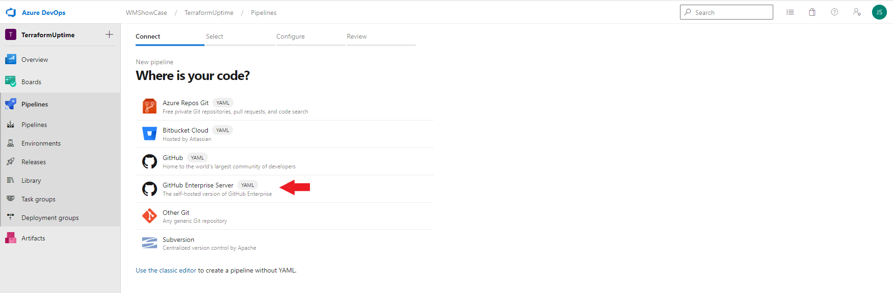

3. Click new connection
    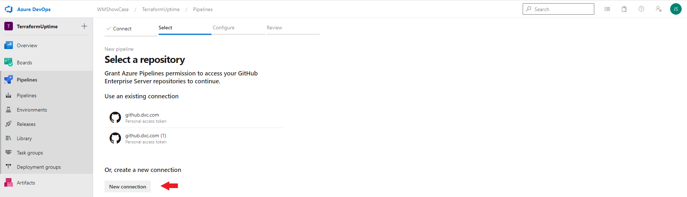

4. Enter your Personal Access Token (PAT), and Enterprise URL (ex. https://github.dxc.com) then click Create
    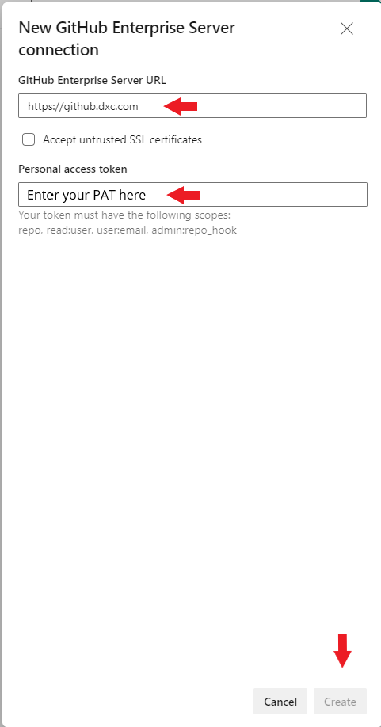

5. Select All Repositories from the dropdown then select your Github path, should be < Organization >/< repository >
    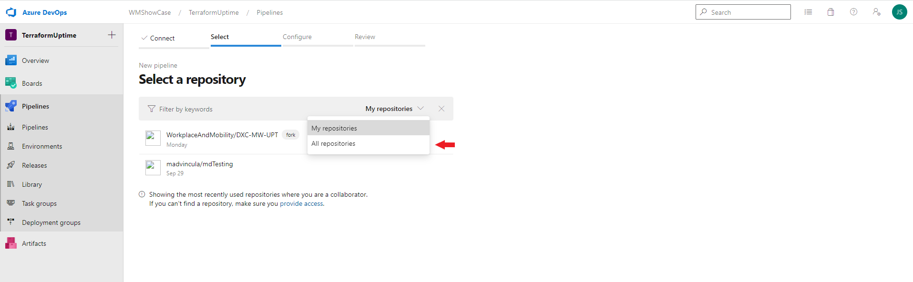

6. Apply for all Front-end, and backend repositories

## Add a new Service Connection for Docker/Container
- Docker Registry Service Password can be found by going to 
  ```Azure -> cruptime{env}{uid} -> Access Keys > password ```


## Importing presets

### Note

- Importing a json file will include all the applications, settings and configurations for tasks that will be used in both Front-end and Back-end codes:

- To quickly modify, replace existing items with the proper values, you can use the find function on a text editor you're using by finding this values:  
   - {uid} - uid generated from deploying the provision using Terraform
   - {env} - env used from provision
   - {directory} - directory of the artifact/build pipeline location (ex. _UptimeforShowcase)
   - {az_subscription} - Subscription ID


> [Get showcase backend release pipeline template deployment json here](../../../../assets/CI_CD%20-%20Default.json)

- After importing, make sure to remove all the artifacts

1. Reimport the artifacts by clicking on the '+' button beside 'Artifacts', and reimport every pipeline created mentioned in the first section "Creating a pipeline for each artifacts".
  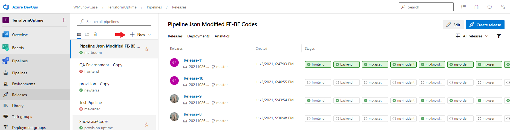

2. Click on '1 job 7 tasks' in 'frontend', under Stages
  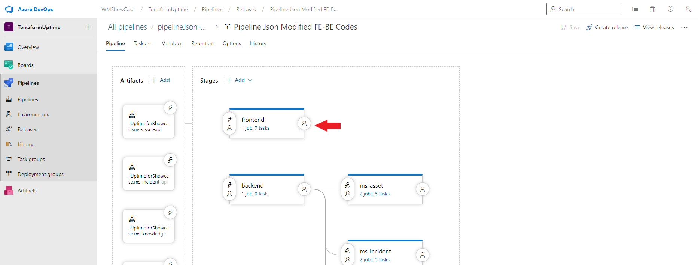

3. On 'Agent Job', select in 'Agent pool' your Azure Pipeline
  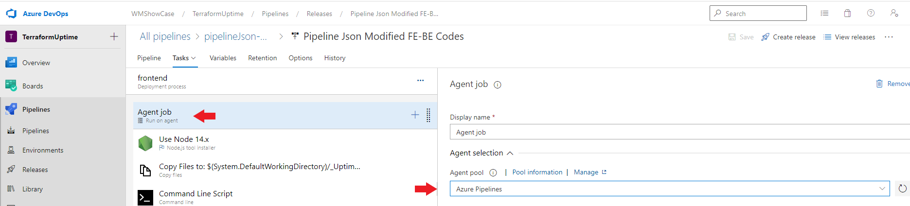

4. On 'Agent Specification', select the 'latest Ubuntu version' for tasks that has 'Container' and the 'Front-end' part. For backends that has the 'PowerShell script' tasks, please select 'windows-2019'.
  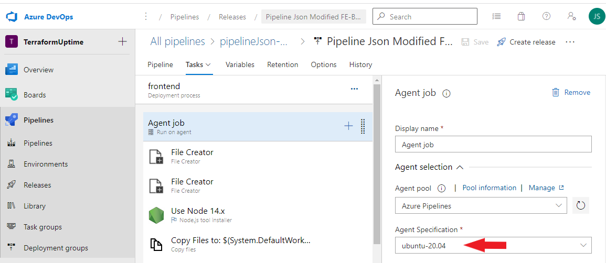

5. Under 'Agent Job', check each tasks and make sure that Source Folder, Target Folder, File Path are all located in your system's working directory. ex:

`Current path: $(System.DefaultWorkingDirectory)/_UptimeforShowcase.uptime-storybook/uptime-storybook`

`Replace to: $(System.DefaultWorkingDirectory)/_<Your-git-org-here>.uptime-storybook/uptime-storybook`
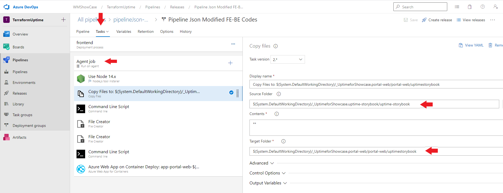

6. Rename the CosmosDB path with your current CosmosDB on the backend artifacts:
  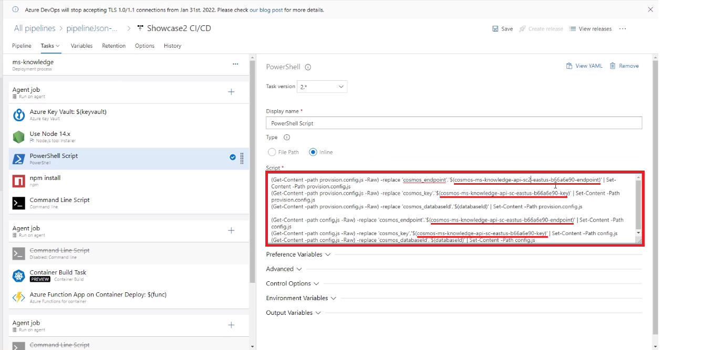


7. In the Variables tab, make sure your variables below are not modified: 
  - az_subscription - *can be found in your service connection*
  - REACT_APP_OCP_APIM_SUBSCRIPTION_KEY *can be found in your service connection*
  - uid *can be found on the first pipeline/release setup, which is the provision we created in (01 Azure - Provision/02 Deployment Steps)*

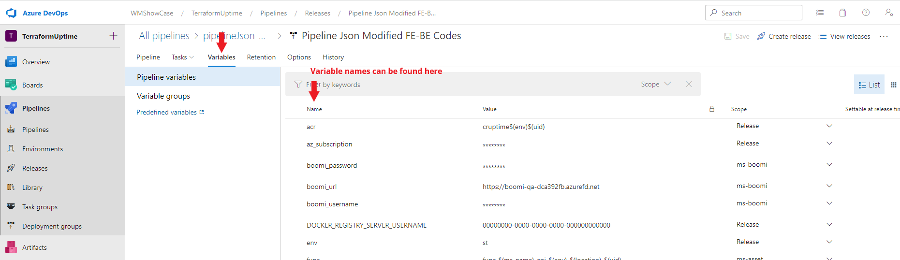

8. Some Variables configurations:

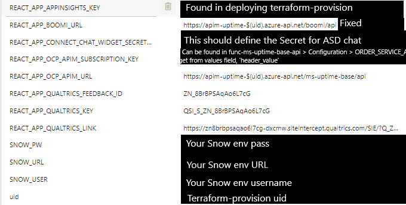

9. For most backend that has the 'API Management - Create/Update API', add:  
  Unlimited  
  uptime

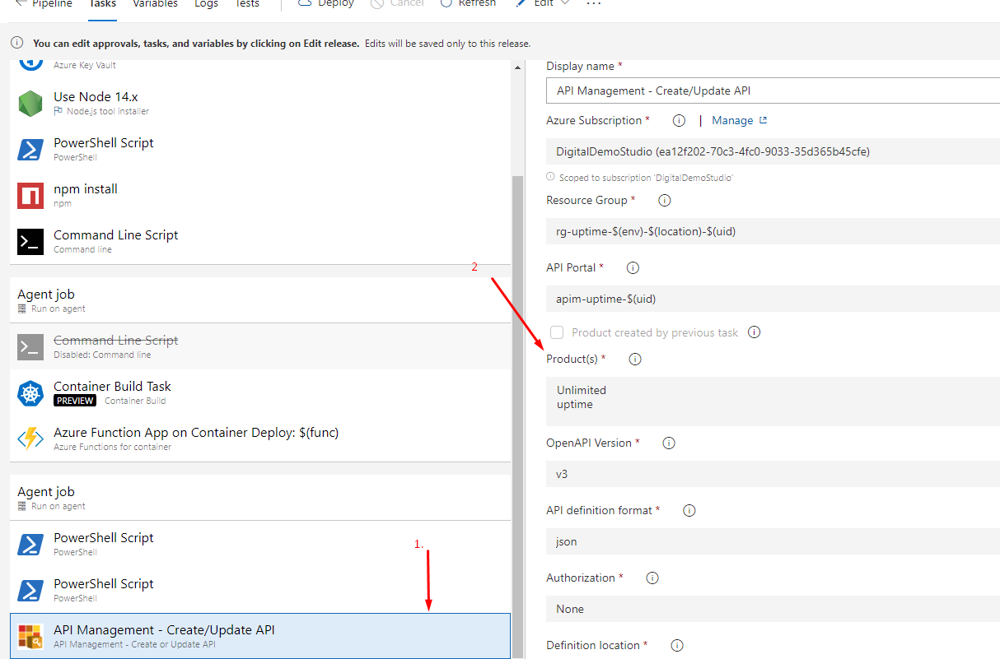

## Re-deploying latest releases (if issues exist)

1. Go to Release, and click your codes pipeline then click on 'Edit'

2. For backend 
* ms-asset 
* ms-order 
* ms-knowledge 
* ms-incident 
* ms-uptime

Apply these steps below to the apis mentioned above.

We will be working on the ms-asset:

a. Click on ms-asset '3 jobs, 11 tasks'
b. Applicable for the tasks below, on the first Agent job:
* Powershell Script
* Command Line Script
* npm install

Click on each, and then click on 'Advanced'

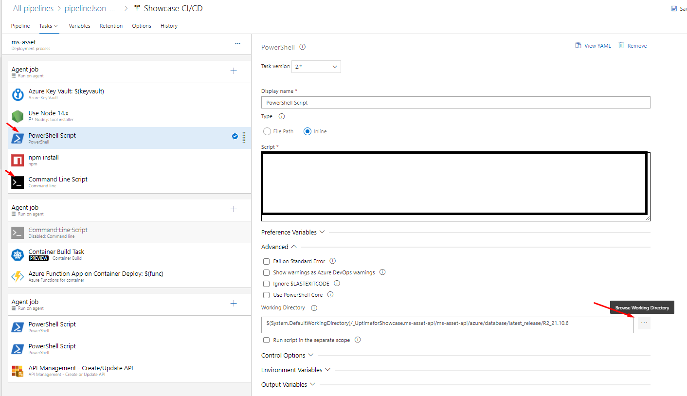

c. Click on the three dots, and locate the api we are currently configurin - at this moment 'ms-asset-api'

d. Locate on the folders the 'database' folder, found at /azure/database/latest_release/
e. Select the earliest release (ex. R2 21.10.6)
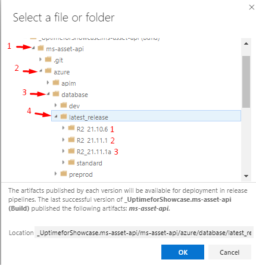

f. Apply the same steps above for the 'npm install' task

g. Click on Create Release on the upper right part of the screen

h. Repeat the same creation of releases in order, going all the way up to the latest release. Ex:
* Release 1: R2 21.10.6
* Release 2: R2 21.11.1
* Release 2: R2 21.11.1a

i. This is what it would look like once done  
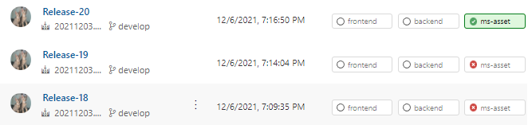

> Note that some releases are failed or marked as 'x'. You can cancel the deployment once the first Agent Job is done and it would still apply the changes

# **Client Customization Guide**

## Overview  

><i>The Overview section holds the high-level configurable areas of the Uptime. The customizable will list all the current possible configurable aspects of Uptime and include also the components that are non-configurable dated, and currently on the roadmap.

>In this document will also include the guide on applying the current available customizable parts of Uptime.</i>

This document focuses on the possible areas that can and will be customized as part of the portal rollout for customers. Please take note of the release information within each of the links referenced below for proper guidance.

The configurations that can be customized are different depending on agreement with the customer and overall environment state. These are stored as part of the Azure space within the Cosmos DB.

The procedures for applying these customizations are also covered in respective sections of the Installation and Configuration Guide (e.g. API, variables, CosmosDB, etc...)


#### Current state

All changes to the portal's configuration described below as **BRANDING** & **NON-BRANDING** will result in a change in the base code. Proposed changes go through an approval process which flows through 2 teams - UI Design & the Developer Teams (Front End & Back End), details listed below:

- A proposed change is submitted to the appropriate team for approval

  - **BRANDING**: UI Design and Front End Developer Team
    - Each team will work through a User Story in Jira to work on the proposed changes (Design & Implementation). This process is outlined [here](https://confluence.dxc.com/pages/viewpage.action?pageId=243212972&navigatingVersions=true). You can adjust the version history if you need to check the latest one. Once actions are completed, code changes are committed into GitHub
  - **NON-BRANDING**: Back End Developer Team
    - Changes to the code are committed through a release pipeline into the Azure environment, similar to branding they are worked through User Stories in Jira for proper tracking


**NOTE:** There will most likely be changes in this approach, this space will be updated once plans are finalized


#### Branding

The below information refers to the front-end (UI design) specifications that can be configured/customized if so desired. You can find all the current designs [here](https://confluence.dxc.com/display/MWH/Designs), all changes to conventions, workflow, etc. will be reflected at this location accordingly. (Note: Some of the items listed below are still being worked on by the dev team to be available for customization)

- Login page (Authentication) [< click here for the instruction guide >](#aLogin)  
  - Authentication (like Okta) can be indicated on the Azure DevOps
- Landing page [< click here for the instruction guide >](#aLanding)
  - Customer Logo and Favicon. 
  - Customer Portal Color Theme
  - Customer Font Size, Style, Color, Font Name < [Refer here for developers document](https://confluence.dxc.com/display/MWH/Configuration+-+Branding) >
- Limited Access Landing Page
  - This can also be considered under the Pilot Mode currently which can be found here [< click here for the instruction guide >](#aLimitedAccessLandingPage)   
    This is currently under development.
  - ITSM Portal URL - Added in the list for to do
- User profile (Photo)
  - User profile image file can be located in Azure Active Directory which is also linked in O365.
  - Switching from a different source is considered, and will be on to-do list in development stage  
- Survey (Qualtrics)
  - Removing the Feedback button by removing Qualtrics [< click here for the instruction guide >](#aQualtrics)   

#### Potential new configurations  

Overall Potential new configurations can be found [here](https://confluence.dxc.com/pages/viewpage.action?pageId=290599765), included are:
- In progress
  - Landing Page
  - ITSM Portal URL
  - User Profile (Photo)
  - Language

- To do
  - Limited Access Landing Page
  - User Profile details in other sources (ex: Azure AD, Workday, etc..)
  - Language
  - Resource Limitations


Current resources used for design, branding and general portal UI can be found [here](https://confluence.dxc.com/display/MWH/Design+Resources). Resource categories defined as well (Approved, Agile, Design, etc.)  

#### Non-branding

The below configuration pages are located in this main [page](https://confluence.dxc.com/display/MWH/Technical+Designs+-+WIP) and it is advised to check this space as more configuration pages are added.

At its current state, the specifics that can be configured and can be taken :

- Policies for PC Lifecycle/Refresh (Asset)  
  Configurations are not yet applicable. Connect with the Boomi Team to have this configured which are the:
  - Item availability or stock
  - User qualification
  - Refresh status
  - Flags

- Incident Lifecycle [< click here for the instruction guide >](#aIncidentLifecycle) 
  - Incident Filters  
  - Incident State <> Filter Mappings
    - Incident State Mappings
    - Incident Resolved State
  - Incident Resolved Close Code
  - Incident Resolved Close Notes
  - Incident Resolved Comment
    - Incident Reopen State
    - Incident Reopen Comment
  - Incident Action Rules

- Knowledge documentation specifications [< click here for the instruction guide >](#aKnowledgeLifecycle) 
  - Knowledge Template URL
  - Knowledge Annoucement Conditon
  - Knowledge Content Text Limit
  - Knowledge Annoucement Encoded Query
  - Knowledge Featured Encoded Query
  - Knowledge News Encoded Query
  - Knowledge Top View By Category Encoded Query

- Policies for item procurement (Order) [< click here for the instruction guide >](#aOrder)
  - Request Item State <> Filter Mappings
  - Request Item Filter Mappings
    - Request Item State Mappings
    - Request Item Action Rules

- Location (Shipping) [< click here for the instruction guide >](#aShipping)
  - Country
    - countryMap
  - Country specifications (State, City, Region)
    - countryAddressFields
  - Shipping provider
    - providerMap

- Other preferences (UPtime-based)
  - Password preferences (length, expiry, reminder, link)

  - Attachment limitations (file extension, size)


##### Resource limitations

- Restrictions on the file type and size of resource files such as company logo will be documented as DXC encounters specific incompatibilities. At the current time, no restrictions are known, apart from using reasonably-sized logos that fit within the visual framework of the UPtime page headers.


## Apply Customization instructions   

Connecting to CosmosDB in Azure will block your IP Address due to IP addresses not registered in the firewall setting
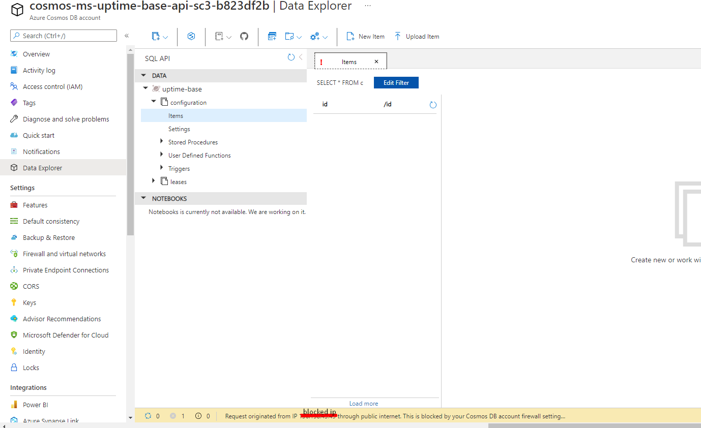

In order to access the CosmosDB Data Explorer, do the following steps:  
    1. In the CosmosDB of the current API in Azure, locate Settings section on the side panel
    2. Click 'Firewall and virtual networks'
    3. Click 'Add my current IP (192.168.0.1)'

 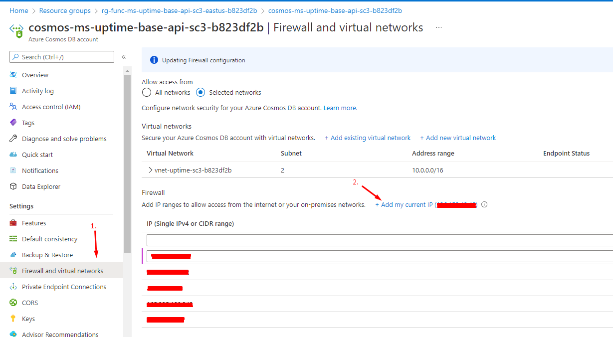

### Branding

#### Login Page <a name="aLogin"></a>
>In authentication, please make sure that the prerequsities are already available such as Base URL, ClientID, Logo
- Authentication
  - The authentication and the redirect can be configured in the Azure DevOps Front-end section
    1. Log-on to your Azure DevOps and go to the front-end release pipeline
    2. Click on Tasks, and locate the 3rd File Creator under the CMD script
    3. Scroll down until you see the 3 sections which shows
        - REACT_APP_OKTA_BASE_URL= #######
        - REACT_APP_OKTA_CLIENTID= ###########
        - REACT_APP_OKTA_LOGO= #############  

#### Landing Page <a name="aLanding"></a>
- Customer Logo and Favicon
    1. Log in to Azure DevOps
    2. Go to Release pipeline
    3. Select ms-uptimebase-api
    4. Click Edit > Task
    5. Create a new task (Azure Blob)
    6. Refer [here](https://jira.dxc.com/browse/MWA-8187) for the configuration of the new task and CosmosDB for the API.
       - This link [here](https://confluence.dxc.com/display/MWH/Configuration+-+Branding) shows other variables that can be configured. (Draft status)
    7. Double check that AZURE_STORAGE env variable is added in func-uptime-base with the value shown below.
        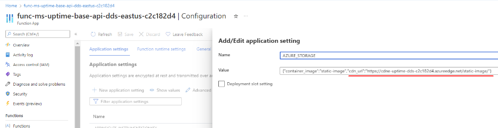

#### Limited Access Landing Page <a name="aLimitedAccessLandingPage"></a>
> Database Configurations such as CosmosDB requires a different level of access which authenticates directly to the host (like SSH) in local connection settings
- Limited Access Landing Page: As of now, this can be currently done via Pilot Mode. Reference link [here](https://confluence.dxc.com/display/MWH/User+API+Config)  
  <i>Note that if the value is blank or empty, users who has assigned and accessed SNOW (DXCI) can use Uptime portal. </i>
  1. Locate the ms-user-api resource group in Azure
  2. Apply the changes:
      - {
          "type": "PILOT_USER_GROUP_NAME",  
          "value": "Uptime Pilot Users",  
          "id": "3284c5cf-c5c3-4ad4-b765-3ab2be785176"  
            }


### Non- Branding 
> Database Configurations such as CosmosDB requires a different level of access which authenticates directly to the host (like SSH) in local connection settings.  
> Once able to access the CosmosDB, go to the Resource Group of the API to configure (ex: rg-func-ms-user-api-ph3-ph-id89231 ) 

#### Incident Lifecycle <a name="aIncidentLifecycle"></a>
This can be done via configuration in CosmosDB
- Configuration are currently listed under the link [here](https://confluence.dxc.com/display/MWH/Incident+API+Config)
- Environment Variables as indicated from the link provided above, can also be configured such as CUSTOM_INTEGRATION <i>(Which is indicating if REST API is used or false if Table API will be used)</i>, SNOW URL,CosmosDB

#### Knowledge Lifecycle <a name="aKnowledgeLifecycle"></a>
This can be done via configuration in CosmosDB
- Configuration are currently listed under the link [here](https://confluence.dxc.com/display/MWH/Knowledge+API+Config)
- Environment Variables as indicated from the link provided above, can also be configured such as CUSTOM_INTEGRATION <i>(Which is indicating if REST API is used or false if Table API will be used)</i>, SNOW URL,CosmosDB

#### Policies for item procument (Order) <a name="aOrder"></a>
This can be done via configuration in CosmosDB
- Configuration are currently listed under the link [here](https://confluence.dxc.com/display/MWH/Order+API+Config)
- Environment Variables as indicated from the link provided above, can also be configured such as CUSTOM_INTEGRATION <i>(Which is indicating if REST API is used or false if Table API will be used)</i>, SNOW URL,CosmosDB

#### Shipping <a name="aShipping"></a>
This can be done via configuration in CosmosDB
- Configuration are currently listed under the link [here](https://confluence.dxc.com/display/MWH/Shipping+API+Config)
- Environment Variables should also be configured if there are new providers with parameters such as URL, SECRET_KEY, PASSWORD, ACCOUNT NUMBER, METER_NUMBER
  1. This can be done by going to Azure DevOps
  2. Go to the release pipeline of the environment to be configured
  3. Edit Pipeline
  4. Go to Variables and add/edit the parameters as needed.

#### Qualtrics <a name="aQualtrics"></a>
Removing Code Snippet values from CosmosoDB in uptime-base api
- Configuration are currently listed under the link [here](https://confluence.dxc.com/display/MWH/UPtime-base+API+Config)
- The values as indicated on the link above, shall have blank values - example:
``` {
    "id": "",
    "type": "",
    "value": [
        {
            "qualtricsInstanceID": "",
            "snippetValue": ""

        }
    ]
}
```

# **Integrating UPtime with Teams App**

This document contains the instructions on how to integrate UPtime with a customer's Microsoft Teams app.

The process will be divided in to two separate tasks by the Development team and the Customer.

1. Development team's task - The team will generate a Manifest.json for UPtime that needs to be sent to the customer. Refer below on how to generate the manifest:


​	1.1 Open Microsoft Teams app

​	1.2 Click on the **Ellipsis** > **App Studio** to install.

​	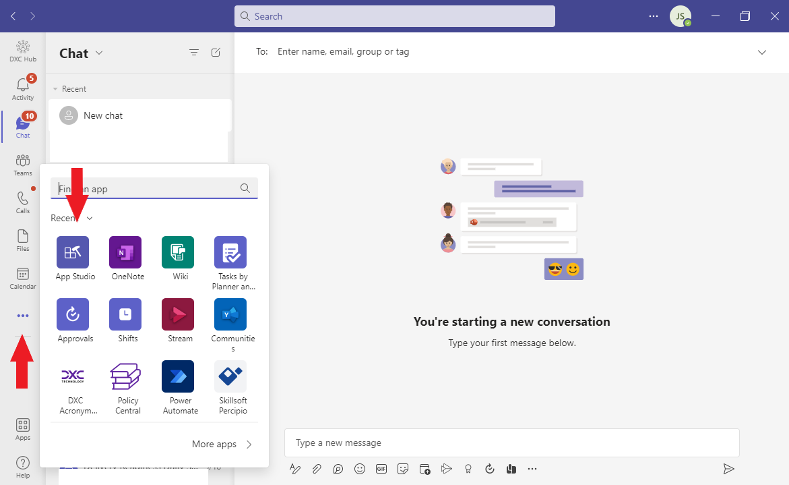


​	1.3 Click **Create a new app**

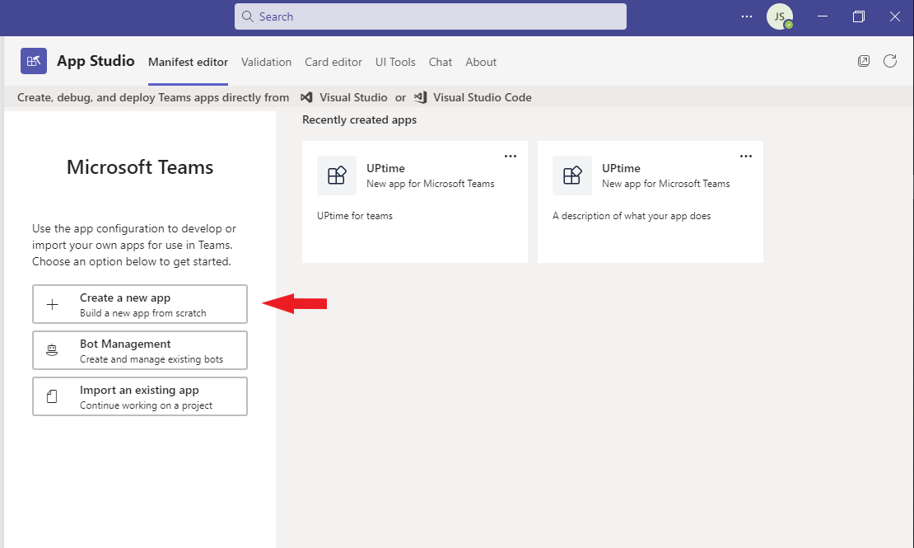


​	1.4 Enter the application (UPtime) details.

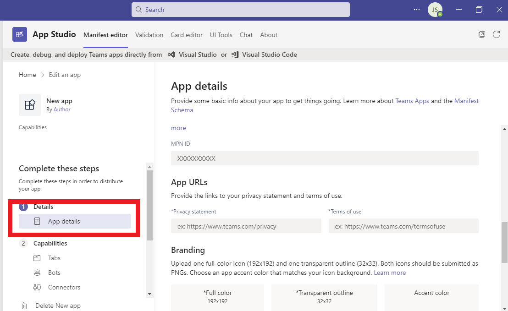


​	1.5 Click **Tabs** > **Add** under **Add a Personal Tab**

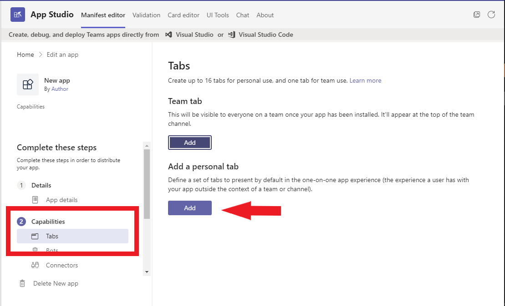


​	1.6 Input the tab details then click **Save**.

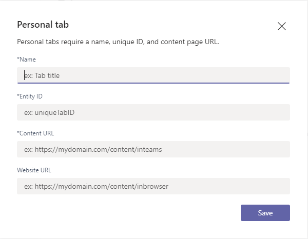

​	

​	1.7 Go to **Finish** section then click **Test and distribute** > **Download**

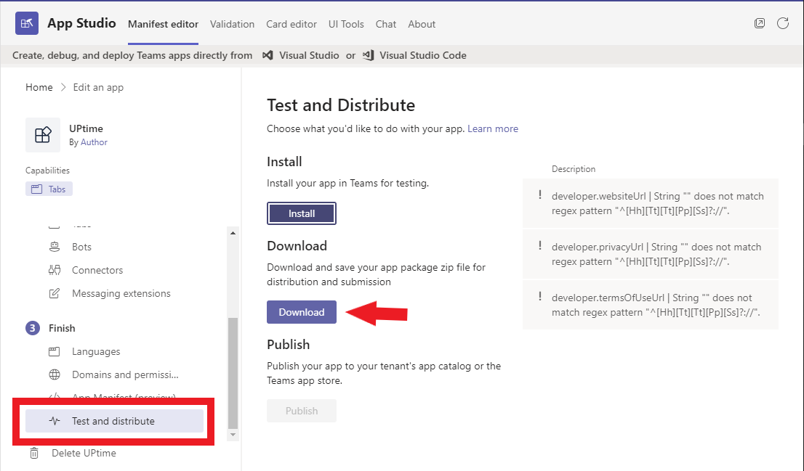


​	1.8 A .zip file will be generated that includes the Manifest.json file along with two other files. The package will be sent to the Customer.

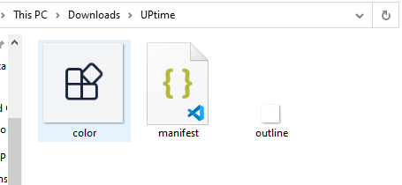


2. The Customer's Microsoft Teams admin will push the package to their company store.

# **User Profile Picture configure via AAD**

This document will guide to configure Azure Active Directory to access the user profile picture. This is 
required in the customer's Azure AD Tenant


## Instructions 

> *NOTE IF YOU ALREADY HAVE AAD APP REGISTERED: the steps under creating/registering aad are required for creating the service principal, if the application has been already created, you can skip the steps and confirm that  
> 1. Who can use this application or access this API? - Accounts in this organizational directory only (Single-tenant) [*Click here to go to step 1*](#s1) 
> 2. API Permissions has MS-Graph which has - User.Read.All [*Click here to go to step 3*](#s3) 
> 3. API permissions has - Grant admin consent for < single-tenant > [*Click here to go to step 4*](#s4) 

## Creating/Registering an application and granting API access permission

1. <a name="s1"></a> Register an application in Azure AD

      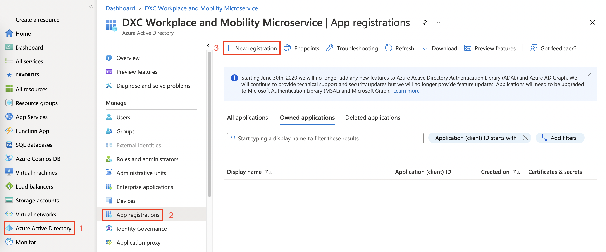

      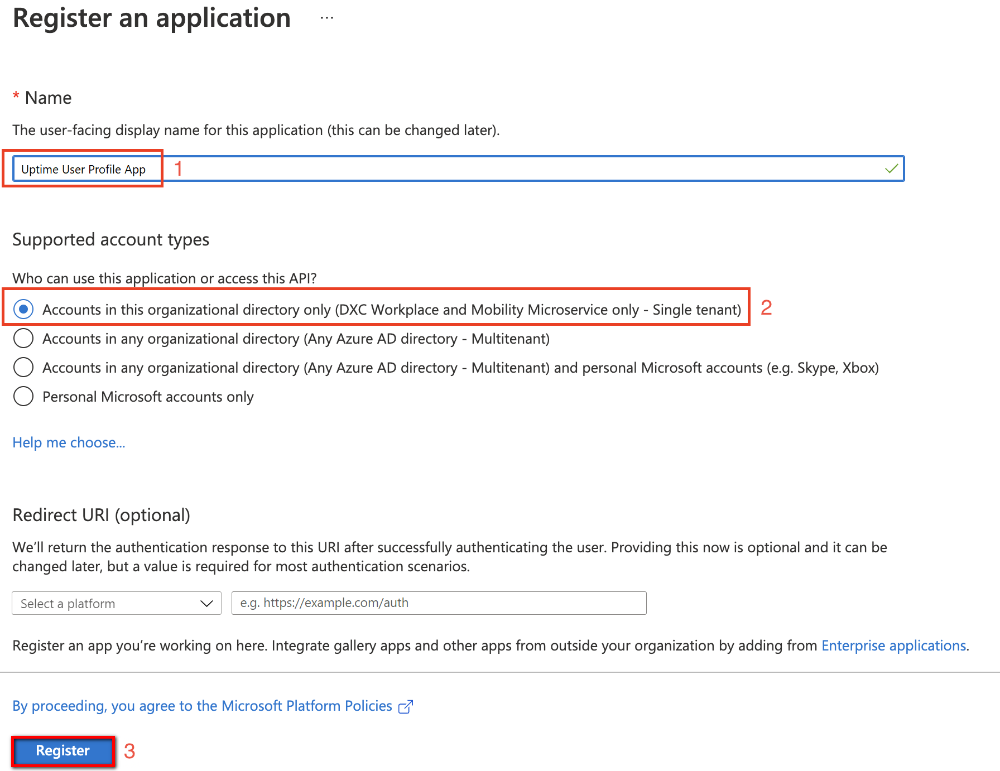

      

      
      

2. <a name="s2"></a> Create a new client secret

      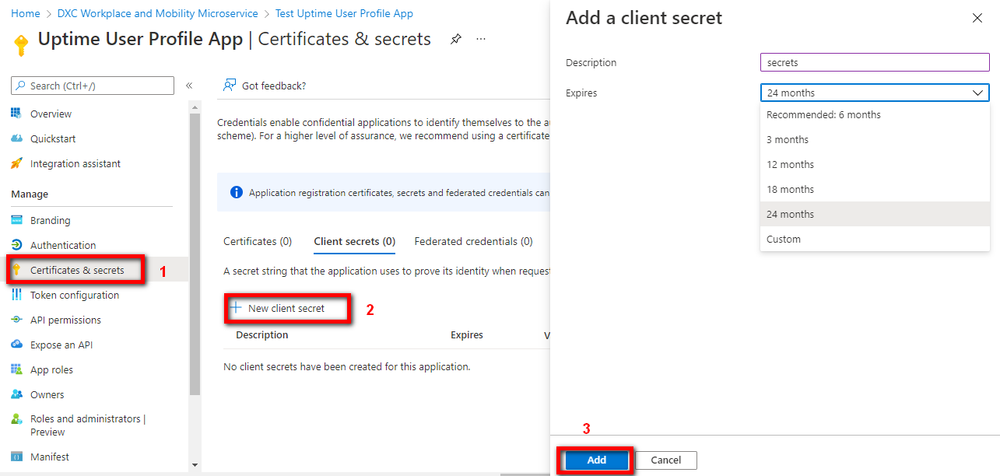

     *Copy client secret value* 

3. <a name="s3"></a> Grant API Permissions

     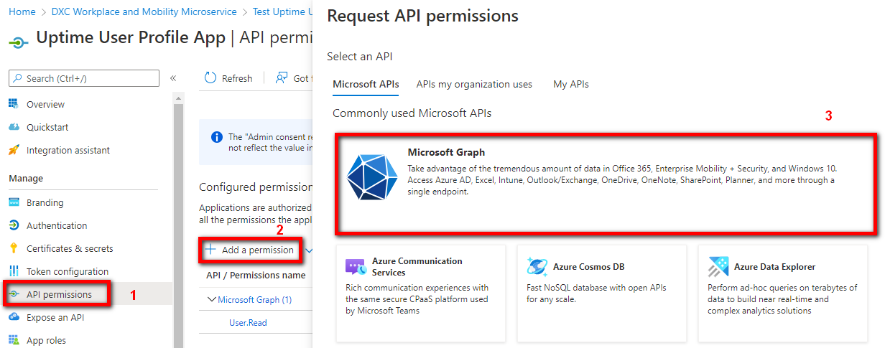


     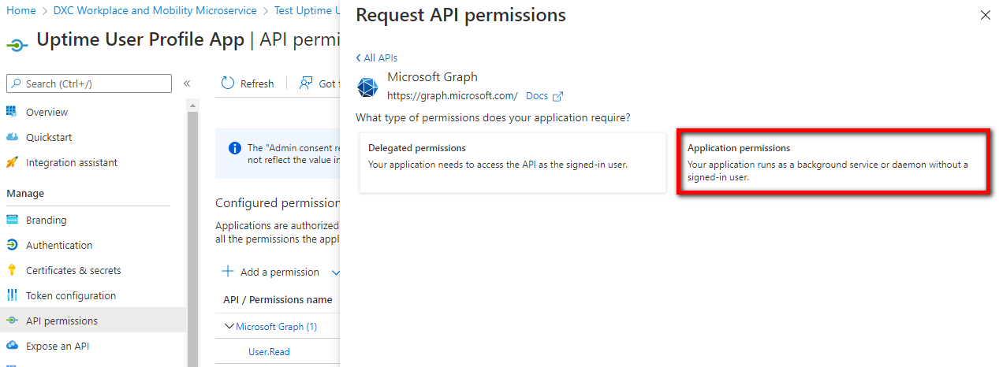


     
     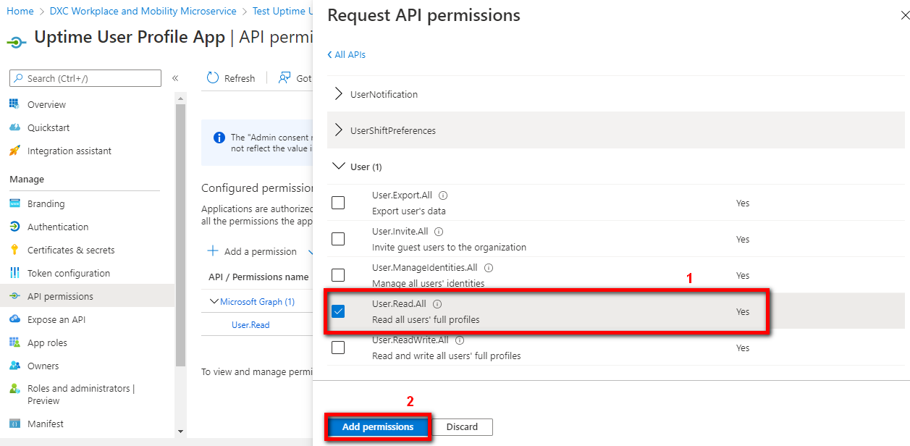


4. <a name="s4"></a> Grant Admin Consent

     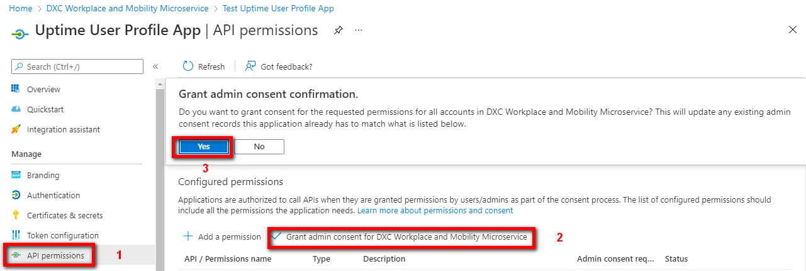


     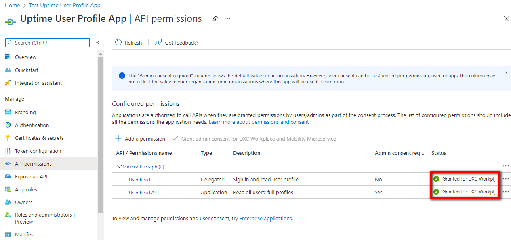


*Provide Tenant ID, Client ID and Client Secret to the deployment team*

## User Profile Picture AAD Access

This document will guide to configure Azure Active Directory to access the user profile picture. This is 
required in the customer's Azure AD Tenant


## Instructions 

> *NOTE IF YOU ALREADY HAVE AAD APP REGISTERED: the steps under creating/registering aad are required for creating the service principal, if the application has been already created, you can skip the steps and confirm that  
> 1. Who can use this application or access this API? - Accounts in this organizational directory only (Single-tenant) [*Click here to go to step 1*](#s1) 
> 2. API Permissions has MS-Graph which has - User.Read.All [*Click here to go to step 3*](#s3) 
> 3. API permissions has - Grant admin consent for < single-tenant > [*Click here to go to step 4*](#s4) 

## Creating/Registering an application and granting API access permission

1. <a name="s1"></a> Register an application in Azure AD

      

      

      

      
      

2. <a name="s2"></a> Create a new client secret

      

     *Copy client secret value* 

3. <a name="s3"></a> Grant API Permissions

     


     


     
     


4. <a name="s4"></a> Grant Admin Consent

     


     


*Provide Tenant ID, Client ID and Client Secret to the deployment team*


